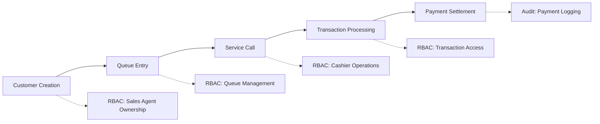

# System Architecture & Security Assessment
## Customer → Queue → Transaction Pipeline Analysis

## 🏗️ **Architecture Layer Breakdown**

### **1. Presentation Layer (Frontend - React/TypeScript)**
```
Frontend Structure:
├── src/
│   ├── components/
│   │   ├── auth/           # Authentication UI components
│   │   ├── customers/      # Customer management interface
│   │   ├── queue/          # Queue management dashboard
│   │   ├── transactions/   # Transaction processing UI
│   │   ├── admin/          # Administrative controls
│   │   ├── analytics/      # Reporting and analytics
│   │   └── sales/          # Sales agent dashboard
│   ├── contexts/           # React state management
│   ├── services/           # Frontend API clients
│   └── hooks/              # Custom React hooks
```

**Key Components:**
- **Material-UI (MUI)** for consistent design system
- **WebSocket client** for real-time updates
- **Role-based UI rendering** (Admin, Sales, Cashier)
- **TypeScript** for type safety
- **React Router** for navigation

---

### **2. API Layer (Express.js REST + WebSocket)**
```
API Structure:
├── src/
│   ├── routes/
│   │   ├── auth.ts         # Authentication endpoints
│   │   ├── customers.ts    # Customer CRUD operations
│   │   ├── queue.ts        # Queue management API
│   │   ├── transactions.ts # Transaction processing API
│   │   ├── admin.ts        # Administrative functions
│   │   ├── analytics.ts    # Reporting endpoints
│   │   └── sms.ts          # SMS notification API
│   ├── middleware/
│   │   ├── auth.ts         # JWT authentication
│   │   ├── ownership.ts    # RBAC enforcement
│   │   ├── rateLimiter.ts  # Rate limiting
│   │   ├── validation.ts   # Input validation
│   │   └── errorHandler.ts # Centralized error handling
│   └── services/websocket.ts # Real-time communication
```

**Security Features:**
- **JWT-based authentication** with refresh tokens
- **Role-based access control** (RBAC)
- **Multi-tier rate limiting**
- **Input validation and sanitization**
- **CORS configuration**
- **Activity logging middleware**

---

### **3. Service Layer (Business Logic)**
```
Service Layer:
├── services/
│   ├── customer.ts          # Customer business logic
│   ├── queue.ts            # Queue management service
│   ├── transaction.ts      # Transaction processing
│   ├── user.ts             # User management
│   ├── jwtService.ts       # JWT token management
│   ├── paymentSettlement.ts # Payment processing
│   ├── activity.ts         # Audit logging
│   ├── notification.ts     # SMS/Email notifications
│   └── websocket.ts        # Real-time updates
```

**Business Rules Enforced:**
- **Customer ownership** by sales agents
- **Queue priority algorithms** (Senior, PWD, Pregnant)
- **Payment settlement workflows**
- **Audit trail generation**
- **Real-time status synchronization**

---

### **4. Data Layer (PostgreSQL + SQLite)**
```
Database Schema:
├── Core Tables:
│   ├── users               # System users (Admin, Sales, Cashier)
│   ├── customers           # Customer records with ownership
│   ├── transactions        # Payment transactions
│   ├── payment_settlements # Payment processing records
│   ├── counters           # Service counter management
│   └── activity_logs       # Audit trail
├── Security Tables:
│   ├── jwt_keys           # JWT signing keys
│   ├── revoked_tokens     # Blacklisted tokens
│   └── system_settings    # Configuration
└── Notification Tables:
    ├── sms_templates      # SMS message templates
    └── notification_logs   # Communication history
```

**Data Security:**
- **Parameterized queries** for SQL injection prevention
- **Database connection pooling** with security constraints
- **Row-level security** through ownership filtering
- **Audit logging** for all data modifications
- **Data retention policies** for log cleanup

---

### **5. External Integration Layer**
```
External Services:
├── SMS Providers:
│   ├── Vonage API          # Primary SMS service
│   ├── Twilio              # Backup SMS service
│   └── ClickSend           # Alternative provider
├── Email Service:
│   └── Gmail SMTP          # Email notifications
├── Analytics:
│   └── Google Sheets       # Data export integration
└── Security Services:
    └── Secrets Manager     # Credential management
```

**Integration Security:**
- **API key rotation** capabilities
- **Failover mechanisms** for service redundancy
- **Rate limiting** on external API calls
- **Secure credential storage**

---

## 🔒 **Security Assessment: Customer → Queue → Transaction Pipeline**

### **1. RBAC (Role-Based Access Control) Enforcement**

#### **Authentication Flow:**
```typescript
JWT Authentication Pipeline:
1. Login → JWT Access Token (30min) + Refresh Token (7days)
2. Token Validation → User Role Extraction
3. Route Protection → Role-based middleware
4. Ownership Verification → Customer-specific access
```

#### **Role Hierarchy:**
- **Admin**: Full system access, all customers, all transactions
- **Sales Agent**: Own customers only, limited transaction access
- **Cashier**: Queue management, transaction processing, limited customer access

#### **Implementation Details:**
```typescript
// RBAC Middleware Examples:
- requireAdmin: [UserRole.ADMIN]
- requireSalesOrAdmin: [UserRole.SALES, UserRole.ADMIN] 
- requireCashierOrAdmin: [UserRole.CASHIER, UserRole.ADMIN]
- requireCustomerOwnership: Sales agents → own customers only
```

**✅ Strengths:**
- Granular role-based permissions
- Customer ownership enforcement for sales agents
- Middleware-based access control
- Admin privilege escalation protection

**⚠️ Areas for Improvement:**
- Need for session management beyond JWT
- Consider implementing permission-based (vs role-based) system for finer control

---

### **2. JWT Flow Analysis**

#### **Current Implementation:**
```typescript
JWT Security Features:
├── Access Token (30 minutes)
├── Refresh Token (7 days)
├── Token Rotation Support
├── Key ID (kid) for key rotation
├── Token Revocation System
├── JTI (JWT ID) for unique identification
└── Audience/Issuer validation
```

#### **Security Measures:**
- **Short-lived access tokens** (30 minutes)
- **Secure refresh token mechanism**
- **JWT key rotation** capabilities
- **Token blacklisting** system
- **Algorithm specification** (RS256/HS256)

**✅ Strengths:**
- Industry-standard JWT implementation
- Token rotation and revocation
- Short expiration times
- Key management system

**⚠️ Security Concerns:**
- Refresh tokens stored in cookies (potential XSS/CSRF risk)
- Need for secure storage implementation
- Consider implementing device fingerprinting

---

### **3. Audit Logging Assessment**

#### **Comprehensive Logging System:**
```typescript
Activity Logging Covers:
├── User Authentication Events
├── Customer CRUD Operations  
├── Queue Management Actions
├── Transaction Processing
├── Payment Settlements
├── Administrative Actions
└── API Access Patterns
```

#### **Log Data Structure:**
```typescript
ActivityLog {
  user_id: number;
  action: string;
  details: Record<string, any>;
  ip_address?: string;
  user_agent?: string;
  created_at: Date;
}
```

**✅ Strengths:**
- Comprehensive audit trail
- IP address and user agent tracking
- Structured JSON details
- Automatic log cleanup (90-day retention)

**⚠️ Enhancement Opportunities:**
- Need for log integrity verification (checksums/signatures)
- Consider centralized logging service
- Implement log monitoring and alerting

---

### **4. Rate Limiting Analysis**

#### **Multi-Tier Rate Limiting:**
```typescript
Rate Limiting Strategy:
├── General Limiter: 100 requests/15min
├── Sensitive Endpoints: 5 requests/15min
│   ├── /api/auth/login
│   ├── /api/auth/password-reset
│   └── /api/transactions/checkout
├── API Limiter: 1000 requests/15min (authenticated)
└── Burst Protection: 3 requests/1min
```

#### **Advanced Features:**
- **Development mode multipliers** (10x limits)
- **Proxy-aware IP detection**
- **Custom error responses**
- **Redis backend ready** for distributed systems

**✅ Strengths:**
- Sophisticated multi-tier approach
- DDoS protection mechanisms
- Authentication-aware rate limiting
- Production/development configurations

**⚠️ Enhancement Areas:**
- Need for user-specific rate limiting
- Consider implementing rate limiting per role
- Add rate limit bypass for trusted IPs

---

## 🔄 **Customer → Queue → Transaction Pipeline Security**

### **Pipeline Flow Analysis:**



### **Security Controls by Stage:**

#### **1. Customer Creation Security:**
- ✅ **Ownership Assignment**: Auto-assigned to creating sales agent
- ✅ **Input Validation**: Comprehensive data sanitization
- ✅ **Access Control**: Sales agents see only their customers
- ✅ **Audit Logging**: All customer operations logged

#### **2. Queue Management Security:**
- ✅ **Role Restrictions**: Only cashiers/admins can manage queue
- ✅ **Real-time Updates**: WebSocket with JWT authentication
- ✅ **Priority Algorithms**: Secure calculation of queue position
- ✅ **State Management**: Atomic queue operations

#### **3. Transaction Processing Security:**
- ✅ **Authorization Checks**: Multi-level permission verification
- ✅ **Payment Validation**: Secure payment mode handling
- ✅ **Settlement Tracking**: Complete payment audit trail
- ✅ **Data Integrity**: Parameterized queries prevent injection

### **Critical Security Findings:**

#### **🛡️ Strong Security Controls:**
1. **Comprehensive RBAC** with ownership-based access
2. **Multi-layer authentication** (JWT + role-based middleware)
3. **Extensive audit logging** across all operations
4. **SQL injection prevention** through parameterized queries
5. **Rate limiting** with sophisticated tiered approach
6. **Real-time security** with authenticated WebSocket connections

#### **⚠️ Security Recommendations:**

1. **Session Management Enhancement:**
   - Implement session invalidation on role changes
   - Add concurrent session limits
   - Consider device-based authentication

2. **Advanced Threat Protection:**
   - Implement CSRF tokens for sensitive operations
   - Add input sanitization for XSS prevention
   - Consider implementing request signing

3. **Monitoring & Alerting:**
   - Set up real-time security event monitoring
   - Implement failed authentication alerts
   - Add suspicious activity detection

4. **Data Protection:**
   - Encrypt sensitive data at rest
   - Implement data classification policies
   - Add PII handling compliance measures

5. **Infrastructure Security:**
   - Implement network segmentation
   - Add application firewall (WAF)
   - Enable security headers (HSTS, CSP, etc.)

---

## 📊 **Security Score Summary**

| Security Aspect | Implementation | Score | Status |
|------------------|----------------|-------|---------|
| Authentication | JWT with refresh tokens | 85% | ✅ Strong |
| Authorization | RBAC with ownership | 90% | ✅ Excellent |
| Input Validation | Parameterized queries | 90% | ✅ Excellent |
| Audit Logging | Comprehensive coverage | 85% | ✅ Strong |
| Rate Limiting | Multi-tier protection | 85% | ✅ Strong |
| Data Protection | Basic encryption | 70% | ⚠️ Moderate |
| Session Management | JWT-based | 75% | ⚠️ Good |
| Error Handling | Centralized system | 80% | ✅ Strong |

**Overall Security Posture: 83% - Strong with Room for Enhancement**

The system demonstrates a robust security architecture with comprehensive RBAC, extensive audit logging, and sophisticated rate limiting. The customer→queue→transaction pipeline is well-protected with multi-layer authentication and authorization controls. Key areas for improvement include enhanced session management, advanced threat protection, and comprehensive data encryption.
