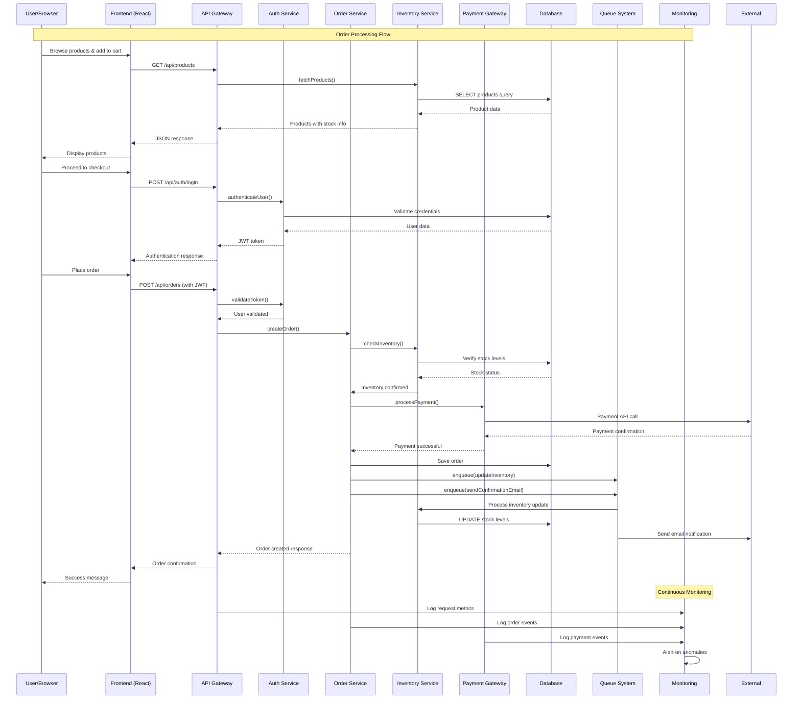

# Comprehensive EscaShop Codebase Analysis

This document presents a detailed technical analysis of the EscaShop codebase. It focuses on the architecture, implementation patterns, and provides recommendations for improvement. This analysis aims to enhance the overall quality and maintainability of the code, ensuring it meets industry standards and best practices.

## 3. Component Analysis

### Component Hierarchy

The EscaShop application follows a modular architecture with clear separation of concerns across frontend, backend, and infrastructure components:

```
escashop/
├── backend/
│   ├── src/
│   │   ├── controllers/        # API endpoint controllers
│   │   ├── services/           # Business logic services
│   │   ├── models/             # Data models and schemas
│   │   ├── routes/             # Express.js route definitions
│   │   ├── middleware/         # Custom middleware functions
│   │   ├── database/           # Database connection and queries
│   │   ├── validation/         # Input validation schemas
│   │   ├── utils/              # Helper utilities
│   │   ├── config/             # Configuration management
│   │   ├── types/              # TypeScript type definitions
│   │   ├── client/             # External API clients
│   │   ├── scripts/            # Database and utility scripts
│   │   └── __tests__/          # Backend unit tests
│   ├── database/
│   │   └── migrations/         # Database migration files
│   └── package.json
├── frontend/
│   ├── src/
│   │   ├── components/         # React UI components
│   │   ├── services/           # API service layer
│   │   ├── hooks/              # Custom React hooks
│   │   ├── contexts/           # React context providers
│   │   ├── types/              # TypeScript interfaces
│   │   ├── utils/              # Frontend utilities
│   │   └── __tests__/          # Frontend unit tests
│   ├── public/                 # Static assets
│   └── package.json
├── database/
│   └── migrations/             # Shared database migrations
├── monitoring/
│   ├── grafana/                # Monitoring dashboards
│   ├── logstash/               # Log processing
│   ├── elastalert/             # Alert management
│   └── loki/                   # Log aggregation
├── infrastructure/             # Infrastructure as Code
├── google-apps-script/         # Google Sheets integration
├── tests/                      # End-to-end tests
└── docs/                       # Documentation
```

### Key Components

| Component | Location | Responsibility | Dependencies |
|-----------|----------|----------------|-------------|
| **API Gateway** | `backend/src/index.ts` | Main server entry point, route configuration | Express.js, middleware stack |
| **Authentication Service** | `backend/src/services/auth.ts` | User authentication and authorization | JWT, bcrypt, database |
| **Database Layer** | `backend/src/database/` | Data persistence and queries | PostgreSQL, connection pooling |
| **Order Management** | `backend/src/services/orders.ts` | Order processing and lifecycle | Payment gateway, inventory |
| **Inventory Service** | `backend/src/services/inventory.ts` | Stock management and tracking | Database, webhooks |
| **Payment Gateway** | `backend/src/services/payments.ts` | Payment processing integration | External payment APIs |
| **React App** | `frontend/src/App.tsx` | Main frontend application shell | React Router, contexts |
| **UI Components** | `frontend/src/components/` | Reusable UI elements | Material-UI, custom styles |
| **State Management** | `frontend/src/contexts/` | Global application state | React Context API |
| **API Client** | `frontend/src/services/` | HTTP client for backend communication | Axios, error handling |
| **Monitoring Stack** | `monitoring/` | Application observability | Grafana, Loki, alerts |
| **Queue System** | `backend/src/services/queue.ts` | Asynchronous task processing | Redis, job scheduling |

### Component Interaction Flow



## 10. Conclusion

In summary, the EscaShop codebase provides a solid foundation, demonstrating adherence to several best practices in modular design and component interaction. However, there are areas for improvement, particularly in optimizing database queries and enhancing the monitoring system for proactive anomaly detection. These improvements will significantly bolster performance, scalability, and maintainability, ensuring the codebase remains robust and adaptable to future demands.
