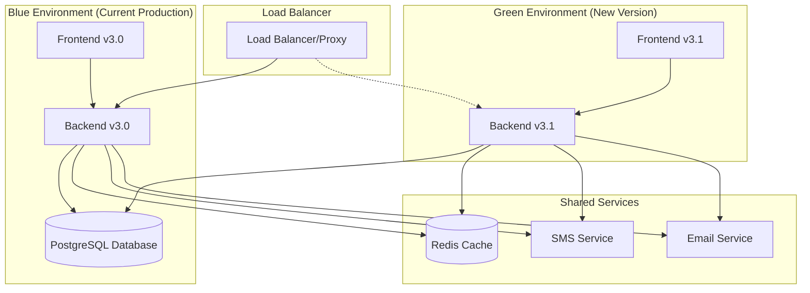

# Blue/Green Deployment & Rollback Strategy Guide

[](CHANGELOG.md)
[](docs/architecture.md)

This document outlines the comprehensive Blue/Green deployment strategy for the EscaShop Optical Queue Management System, ensuring zero-downtime updates and safe rollback procedures.

## Table of Contents

- [Overview](#overview)
- [Blue/Green Deployment Strategy](#bluegreen-deployment-strategy)
- [Database Migration Strategy](#database-migration-strategy)
- [Deployment Process](#deployment-process)
- [Rollback Strategy](#rollback-strategy)
- [Environment Configuration](#environment-configuration)
- [Monitoring & Health Checks](#monitoring--health-checks)
- [Emergency Procedures](#emergency-procedures)

---

## Overview

Our Blue/Green deployment model provides:
- **Zero-downtime deployments**
- **Safe rollback capabilities**
- **Database forward compatibility**
- **Enum backward compatibility**
- **Real-time health monitoring**

### Key Benefits

✅ **Instant rollback**: Switch traffic back to previous version in seconds
✅ **Zero downtime**: Customers never experience service interruption
✅ **Safe testing**: Full production environment testing before traffic switch
✅ **Database safety**: Non-breaking schema changes with forward compatibility

---

## Blue/Green Deployment Strategy

### Infrastructure Layout



### Environment States

| State | Blue Environment | Green Environment | Traffic Direction |
|-------|------------------|-------------------|-------------------|
| **Normal** | Production v3.0 | Idle/Standby | 100% → Blue |
| **Deployment** | Production v3.0 | Deploy v3.1 | 100% → Blue |
| **Testing** | Production v3.0 | Testing v3.1 | 100% → Blue |
| **Cutover** | Production v3.0 | Production v3.1 | 100% → Green |
| **Verified** | Standby v3.0 | Production v3.1 | 100% → Green |

---

## Database Migration Strategy

### Forward-Compatible Migrations

Our database changes must be **additive-only** to support both versions during deployment:

#### ✅ Safe Operations
- **ADD** new columns with default values
- **ADD** new tables
- **ADD** new indexes
- **ADD** new enum values (append-only)
- **CREATE** new functions/procedures

#### ❌ Dangerous Operations
- **DROP** columns or tables
- **RENAME** columns or tables  
- **REMOVE** enum values
- **ALTER** column types (breaking changes)

### Enum Compatibility Strategy

For queue status enums, we maintain backward compatibility:

```sql
-- v3.0 enum values
'waiting', 'serving', 'completed', 'cancelled'

-- v3.1 adds new value (safe)
'waiting', 'serving', 'processing', 'completed', 'cancelled'
```

**Migration Process:**
1. **Pre-deployment**: Add new enum value to database
2. **Deploy Backend**: Update API to handle new status
3. **Deploy Frontend**: Update UI to show new status
4. **Verify**: Test all functionality with both old and new values

### Migration Scripts

**Database Schema Update:**
```bash
# Apply migrations before deployment
npm run db:migrate:up

# Verify migration status
npm run db:migrate:status
```

**Sample Migration:**
```sql
-- migrations/20250127_add_processing_status.sql
BEGIN;

-- Add new enum value (backward compatible)
ALTER TYPE queue_status_enum ADD VALUE IF NOT EXISTS 'processing';

-- Add any new columns with defaults
ALTER TABLE customers 
ADD COLUMN IF NOT EXISTS processing_started_at TIMESTAMP DEFAULT NULL;

-- Create indexes for performance
CREATE INDEX IF NOT EXISTS idx_customers_processing_status 
ON customers(queue_status) WHERE queue_status = 'processing';

COMMIT;
```

---

## Deployment Process

### Prerequisites

Before starting deployment:

- [ ] **Database Migrations**: Applied and tested
- [ ] **Feature Flags**: Configured for gradual rollout
- [ ] **Monitoring**: Health checks configured
- [ ] **Rollback Plan**: Documented and tested
- [ ] **Communication**: Team notified of deployment window

### Step-by-Step Deployment

#### Phase 1: Database Migration (5-10 minutes)
```bash
# 1. Apply database migrations
npm run db:migrate:up

# 2. Verify migrations
npm run db:migrate:status

# 3. Check database health
npm run db:health-check
```

#### Phase 2: Backend Deployment (10-15 minutes)
```bash
# 1. Deploy backend to Green environment
docker-compose -f docker-compose.green.yml up -d backend

# 2. Wait for backend health check
./scripts/wait-for-health.sh green-backend 300

# 3. Run integration tests
npm run test:integration:green

# 4. Validate API compatibility
./scripts/test-api-compatibility.sh
```

#### Phase 3: Frontend Deployment (10-15 minutes)
```bash
# 1. Build and deploy frontend to Green environment
npm run build:frontend
docker-compose -f docker-compose.green.yml up -d frontend

# 2. Wait for frontend availability
./scripts/wait-for-health.sh green-frontend 300

# 3. Run end-to-end tests
npm run test:e2e:green
```

#### Phase 4: Traffic Cutover (1-2 minutes)
```bash
# 1. Switch load balancer to Green environment
./scripts/switch-traffic.sh blue-to-green

# 2. Verify traffic switch
curl -f https://api.escashop.com/health

# 3. Monitor for 5 minutes
./scripts/monitor-deployment.sh 300
```

#### Phase 5: Verification (10 minutes)
```bash
# 1. Run smoke tests on production
npm run test:smoke:production

# 2. Check application metrics
./scripts/check-metrics.sh

# 3. Verify core functionality
./scripts/verify-deployment.sh
```

### Deployment Scripts

**Traffic Switch Script:**
```bash
#!/bin/bash
# scripts/switch-traffic.sh

DIRECTION=$1
TIMESTAMP=$(date +%Y%m%d_%H%M%S)

case $DIRECTION in
  "blue-to-green")
    echo "Switching traffic from Blue to Green environment..."
    # Update load balancer config
    cp configs/nginx.green.conf /etc/nginx/sites-enabled/escashop.conf
    nginx -t && nginx -s reload
    echo "Traffic switched to Green environment at $TIMESTAMP"
    ;;
  "green-to-blue")
    echo "Switching traffic from Green to Blue environment..."
    cp configs/nginx.blue.conf /etc/nginx/sites-enabled/escashop.conf
    nginx -t && nginx -s reload
    echo "Traffic switched to Blue environment at $TIMESTAMP"
    ;;
  *)
    echo "Usage: $0 {blue-to-green|green-to-blue}"
    exit 1
    ;;
esac

# Log the switch
echo "$TIMESTAMP: Traffic switched $DIRECTION" >> /var/log/escashop/deployments.log
```

---

## Rollback Strategy

### Automatic Rollback Triggers

The system automatically triggers rollback if:
- **Health checks fail** for more than 2 minutes
- **Error rate exceeds 5%** of requests
- **Response time exceeds 5 seconds** average
- **Database connectivity issues**

### Manual Rollback Process

#### Immediate Rollback (30 seconds)
```bash
# 1. Switch traffic back to Blue environment
./scripts/switch-traffic.sh green-to-blue

# 2. Verify health
curl -f https://api.escashop.com/health

# 3. Check logs
tail -f /var/log/escashop/application.log
```

#### UI Feature Rollback

For partial rollbacks, hide new UI features while keeping backend compatibility:

```javascript
// Feature flag for processing status
const SHOW_PROCESSING_STATUS = process.env.REACT_APP_FEATURE_PROCESSING === 'true';

// Component rendering
{SHOW_PROCESSING_STATUS && (
  <ProcessingStatusComponent />
)}

// Status filtering
const allowedStatuses = SHOW_PROCESSING_STATUS 
  ? ['waiting', 'serving', 'processing', 'completed', 'cancelled']
  : ['waiting', 'serving', 'completed', 'cancelled'];
```

#### Database Rollback Strategy

**Non-Breaking Changes:**
- Keep new enum values (they don't break old code)
- Keep new columns (old code ignores them)
- Keep new tables (old code doesn't access them)

**Breaking Changes (Emergency Only):**
```sql
-- Only if absolutely necessary
BEGIN;

-- Backup affected data first
CREATE TABLE customers_backup AS SELECT * FROM customers;

-- Remove problematic enum value (dangerous!)
-- This would require application downtime
ALTER TYPE queue_status_enum DROP VALUE 'processing';

COMMIT;
```

### Rollback Verification

After rollback:

1. **Functionality Test**: Verify core features work
2. **Data Integrity**: Check no data corruption occurred
3. **Performance Check**: Monitor response times
4. **User Experience**: Verify UI works as expected

---

## Environment Configuration

### Environment Variables

**Blue Environment:**
```env
# .env.blue
NODE_ENV=production
DATABASE_URL=postgresql://user:pass@db:5432/escashop
PORT=5000
API_VERSION=v3.0
ENVIRONMENT=blue
HEALTH_CHECK_URL=http://blue-backend:5000/health
```

**Green Environment:**
```env
# .env.green  
NODE_ENV=production
DATABASE_URL=postgresql://user:pass@db:5432/escashop
PORT=5001
API_VERSION=v3.1
ENVIRONMENT=green
HEALTH_CHECK_URL=http://green-backend:5001/health
```

### Docker Compose Configuration

**Blue Environment:**
```yaml
# docker-compose.blue.yml
version: '3.8'
services:
  backend:
    image: escashop/backend:v3.0
    ports:
      - "5000:5000"
    environment:
      - NODE_ENV=production
      - API_VERSION=v3.0
    healthcheck:
      test: ["CMD", "curl", "-f", "http://localhost:5000/health"]
      interval: 30s
      timeout: 10s
      retries: 3

  frontend:
    image: escashop/frontend:v3.0
    ports:
      - "3000:3000"
    environment:
      - REACT_APP_API_URL=http://backend:5000
```

**Green Environment:**
```yaml
# docker-compose.green.yml
version: '3.8'
services:
  backend:
    image: escashop/backend:v3.1
    ports:
      - "5001:5000"
    environment:
      - NODE_ENV=production
      - API_VERSION=v3.1
    healthcheck:
      test: ["CMD", "curl", "-f", "http://localhost:5000/health"]
      interval: 30s
      timeout: 10s
      retries: 3

  frontend:
    image: escashop/frontend:v3.1
    ports:
      - "3001:3000"
    environment:
      - REACT_APP_API_URL=http://backend:5001
```

---

## Monitoring & Health Checks

### Health Check Endpoints

**Backend Health Check:**
```javascript
// GET /health
{
  "status": "healthy",
  "version": "v3.1.0",
  "environment": "green",
  "timestamp": "2025-01-27T10:30:00Z",
  "checks": {
    "database": "healthy",
    "redis": "healthy", 
    "external_apis": "healthy"
  },
  "uptime": "00:05:32"
}
```

**Detailed Health Check:**
```javascript
// GET /health/detailed
{
  "status": "healthy",
  "version": "v3.1.0",
  "checks": {
    "database": {
      "status": "healthy",
      "response_time": "12ms",
      "connection_pool": "8/20"
    },
    "redis": {
      "status": "healthy", 
      "response_time": "3ms",
      "memory_usage": "45MB"
    },
    "websockets": {
      "status": "healthy",
      "active_connections": 12
    }
  }
}
```

### Monitoring Scripts

**Continuous Health Monitoring:**
```bash
#!/bin/bash
# scripts/monitor-deployment.sh

DURATION=$1
END_TIME=$(($(date +%s) + $DURATION))

echo "Monitoring deployment for $DURATION seconds..."

while [ $(date +%s) -lt $END_TIME ]; do
    # Check health
    HEALTH=$(curl -s http://localhost:5000/health | jq -r '.status')
    
    if [ "$HEALTH" != "healthy" ]; then
        echo "❌ Health check failed: $HEALTH"
        echo "Triggering rollback..."
        ./scripts/switch-traffic.sh green-to-blue
        exit 1
    fi
    
    # Check error rate
    ERROR_RATE=$(curl -s http://localhost:5000/metrics | grep error_rate | awk '{print $2}')
    if (( $(echo "$ERROR_RATE > 0.05" | bc -l) )); then
        echo "❌ Error rate too high: $ERROR_RATE"
        echo "Triggering rollback..."
        ./scripts/switch-traffic.sh green-to-blue
        exit 1
    fi
    
    echo "✅ Health check passed"
    sleep 30
done

echo "✅ Deployment monitoring completed successfully"
```

---

## Emergency Procedures

### Emergency Rollback

**Immediate Response (30 seconds):**
```bash
# Emergency rollback script
#!/bin/bash
echo "🚨 EMERGENCY ROLLBACK INITIATED"

# Switch traffic immediately
./scripts/switch-traffic.sh green-to-blue

# Verify rollback
if curl -f https://api.escashop.com/health; then
    echo "✅ Emergency rollback successful"
else
    echo "❌ Emergency rollback failed - escalate immediately"
fi
```

### Disaster Recovery

**Complete System Recovery:**
1. **Stop all services**
2. **Restore database from backup**
3. **Deploy known good version**
4. **Verify all functionality**
5. **Gradually restore traffic**

### Communication Plan

**Deployment Communication:**
- 📧 **Email**: Notify stakeholders 30 minutes before deployment
- 💬 **Slack**: Real-time updates during deployment  
- 📊 **Status Page**: Update external status page
- 📞 **Emergency Contact**: Have emergency contact available

**Emergency Communication:**
```
🚨 EMERGENCY: EscaShop deployment rollback initiated
Time: [TIMESTAMP]
Reason: [BRIEF_DESCRIPTION]
Status: Rolling back to v3.0
ETA: 2-3 minutes
Contact: [EMERGENCY_CONTACT]
```

---

## Best Practices

### Pre-Deployment Checklist

- [ ] All tests pass (unit, integration, e2e)
- [ ] Database migrations tested in staging
- [ ] Feature flags configured properly
- [ ] Rollback plan documented and tested
- [ ] Monitoring alerts configured
- [ ] Team notified and available during deployment
- [ ] Emergency contacts verified

### Post-Deployment Checklist

- [ ] All health checks passing
- [ ] Core functionality verified
- [ ] Performance metrics within normal range
- [ ] No increase in error rates
- [ ] User experience verified
- [ ] Documentation updated
- [ ] Team notified of successful deployment

### Lessons Learned

**From Previous Deployments:**
- Always test rollback procedures in staging
- Keep deployment windows short (< 30 minutes)
- Monitor for at least 1 hour after deployment
- Have clear communication channels
- Document everything for future deployments

---

*This deployment guide is maintained as part of the EscaShop v3.1.0 release. Last updated: January 27, 2025*

**Related Documentation:**
- [Architecture Guide](docs/architecture.md)
- [API Documentation](backend/docs/openapi.yaml)
- [CHANGELOG](CHANGELOG.md)
- [README](README.md)
