# EscaShop Optical Queue Management System Product Requirements Document (v3.0)

[](docs/architecture.md)
[](https://github.com/escashop/queue-system/actions)
[](LICENSE)
[](CHANGELOG.md)

## 📋 Quick Links

- **[🏗️ Architecture Documentation](docs/architecture.md)** - Complete system architecture, diagrams, and code structure
- **[🚀 Getting Started](#development-setup)** - Setup and installation guide
- **[🔧 Transaction Amount Fix](TRANSACTION_FIX_README.md)** - Fix for zero transaction amounts in local development
- **[🔄 Blue/Green Deployment Strategy](#blue-green-deployment-strategy)** - Zero-downtime deployment details
- **[📊 Features Overview](#key-features)** - Core system capabilities
- **[🔒 Security Guide](SECURITY_HARDENING_GUIDE.md)** - Security implementation details
- **[📈 Reports & Analytics](#transaction-log)** - Financial reporting features

## 1. Architecture Overview

The EscaShop Optical Queue Management System is built on **Next.js 14 with App Router**, leveraging modern web technologies to deliver a robust, scalable, and maintainable solution. The system follows a layered architecture pattern that separates concerns while maintaining clear interfaces between components, ensuring code modularity and easy maintenance.

### Core Architecture Diagram

```mermaid
graph TB
    subgraph "Presentation Layer"
        A["🖥️ Next.js 14 Frontend"]
        B["📱 React Components"]
        C["🎨 Tailwind CSS"]
    end
    
    subgraph "API Layer"
        D["🔗 Next.js API Routes"]
        E["🔌 WebSocket Server"]
        F["🛡️ Middleware & Auth"]
    end
    
    subgraph "Business Logic Layer"
        G["📊 Queue Management"]
        H["👤 User Management"]
        I["💳 Transaction Processing"]
        J["📢 Notification System"]
    end
    
    subgraph "Data Layer"
        K["🗄️ PostgreSQL Database"]
        L["📄 File Storage"]
        M["🔄 Redis Cache"]
    end
    
    subgraph "External Services"
        N["📱 SMS Gateway"]
        O["📊 Google Sheets API"]
        P["🖨️ Thermal Printer"]
    end
    
    A --> B
    B --> C
    A --> D
    D --> E
    D --> F
    F --> G
    F --> H
    F --> I
    F --> J
    G --> K
    H --> K
    I --> K
    J --> K
    K --> L
    K --> M
    J --> N
    I --> O
    G --> P
```



### Key Architectural Decisions

1. **Next.js 14 with App Router**: Chosen for its built-in API routes, server-side rendering capabilities, and excellent developer experience. The App Router provides better performance and developer ergonomics compared to the Pages Router.

2. **PostgreSQL Database**: Selected for its robust ACID compliance, excellent performance with complex queries, and strong support for concurrent operations - essential for queue management and financial transactions.

3. **WebSocket Integration**: Implemented for real-time queue updates and display monitor synchronization, ensuring instant updates across all connected clients without polling overhead.

4. **Role-Based Access Control (RBAC)**: Implemented at the middleware level to ensure secure access to different system areas based on user roles (Admin, Sales, Cashier).

5. **Microservice-Ready Architecture**: While currently monolithic, the layered structure allows for easy extraction of services (queue management, notifications, reporting) into separate microservices as the system scales.

---

## 2. Technology Stack

The EscaShop Optical Queue Management System leverages a modern, full-stack JavaScript/TypeScript architecture designed for scalability, maintainability, and real-time performance. Our technology choices prioritize developer experience, security, and operational efficiency.

### Core Technologies

| **Category** | **Technology** | **Version** | **Purpose** | **Rationale** |
|--------------|----------------|-------------|-------------|---------------|
| **Frontend Framework** | React | ^19.1.0 | UI Library | Industry-standard component-based architecture |
| **Frontend Language** | TypeScript | ^4.9.5 | Type Safety | Enhanced code quality and developer experience |
| **Frontend Build Tool** | React Scripts | 5.0.1 | Build System | Zero-configuration build toolchain |
| **Backend Framework** | Express.js | ^4.18.2 | Web Server | Lightweight, flexible Node.js framework |
| **Backend Language** | TypeScript | ^5.2.2 | Type Safety | Consistent language across full stack |
| **Backend Runtime** | Node.js | 18+ | Server Runtime | JavaScript runtime for server-side execution |
| **Database** | PostgreSQL | 12+ | Primary Database | ACID compliance, complex queries, concurrency |
| **Real-time Communication** | Socket.IO | ^4.8.1 | WebSocket Library | Reliable real-time bidirectional communication |

### UI/UX Technologies

| **Category** | **Technology** | **Version** | **Purpose** | **Benefits** |
|--------------|----------------|-------------|-------------|-------------|
| **CSS Framework** | Tailwind CSS | ^4.1.11 | Utility-First Styling | Rapid development, consistent design system |
| **Component Library** | Material-UI (MUI) | ^7.2.0 | Pre-built Components | Professional UI components, accessibility |
| **Icons** | MUI Icons | ^7.2.0 | Icon System | Comprehensive icon library |
| **Drag & Drop** | @dnd-kit | ^6.3.1 | Drag & Drop Functionality | Queue reordering, intuitive interactions |
| **Routing** | React Router | ^7.6.3 | Client-side Routing | Single-page application navigation |
| **Charts** | Recharts | ^3.1.0 | Data Visualization | Transaction reports, analytics dashboard |

### Backend Services & Utilities

| **Category** | **Technology** | **Version** | **Purpose** | **Use Case** |
|--------------|----------------|-------------|-------------|-------------|
| **Authentication** | JWT | ^9.0.0 | Token-based Auth | Secure user sessions, role-based access |
| **Password Hashing** | Argon2 | ^0.43.1 | Password Security | Industry-standard password hashing |
| **Password Fallback** | bcrypt | ^5.1.0 | Legacy Support | Backward compatibility |
| **Validation** | Express Validator | ^7.2.1 | Input Validation | Server-side data validation |
| **CORS** | CORS | ^2.8.5 | Cross-Origin Requests | Frontend-backend communication |
| **Environment Config** | dotenv | ^17.1.0 | Configuration Management | Environment variable handling |
| **Date/Time** | Moment Timezone | ^0.6.0 | Date Manipulation | Timezone-aware date operations |
| **Cron Jobs** | node-cron | ^4.2.1 | Scheduled Tasks | Daily resets, cleanup operations |
| **File Processing** | ExcelJS | ^4.4.0 | Spreadsheet Generation | Report exports, data analysis |
| **PDF Generation** | jsPDF | ^3.0.1 | PDF Reports | Transaction reports, receipts |
| **QR Codes** | qrcode | ^1.5.4 | QR Code Generation | Customer tokens, digital receipts |
| **Email Service** | Nodemailer | ^7.0.5 | Email Notifications | Password resets, system alerts |
| **SMS Service** | Vonage SDK | ^3.22.0 | SMS Notifications | Customer queue notifications |
| **HTTP Client** | Axios | ^1.10.0 | API Requests | External service integration |
| **Unique IDs** | UUID | ^11.1.0 | ID Generation | Transaction IDs, session management |

### Database & Data Management

| **Category** | **Technology** | **Version** | **Purpose** | **Features** |
|--------------|----------------|-------------|-------------|-------------|
| **Primary Database** | PostgreSQL | ^8.7.1 (Client) | Relational Database | ACID compliance, complex queries, JSON support |
| **Database Client** | pg (node-postgres) | ^8.7.1 | PostgreSQL Driver | Connection pooling, prepared statements |
| **Development DB** | SQLite3 | ^5.1.7 | Local Development | Lightweight development database |
| **Cache (Future)** | Redis | ^5.6.1 | Caching Layer | Session storage, real-time data caching |
| **File Exports** | XLSX | ^0.18.5 | Excel Integration | Spreadsheet exports, data interchange |

### Development & Testing Tools

| **Category** | **Technology** | **Version** | **Purpose** | **Scope** |
|--------------|----------------|-------------|-------------|----------|
| **End-to-End Testing** | Playwright | ^1.54.1 | E2E Testing | User workflow testing, browser automation |
| **Unit Testing** | Jest | ^30.0.4 | Unit/Integration Testing | Backend logic testing, API testing |
| **Testing Utils** | React Testing Library | ^16.3.0 | React Component Testing | Component behavior testing |
| **Type Checking** | TypeScript | ^5.2.2 / ^4.9.5 | Static Analysis | Compile-time error detection |
| **Development Server** | Nodemon | ^3.0.1 | Auto-restart | Backend development server |
| **Process Management** | Concurrently | ^8.2.2 | Multi-process Runner | Frontend/backend simultaneous development |
| **Code Quality** | ESLint | ^9.31.0 | Code Linting | Code style, security issue detection |
| **Security Linting** | ESLint Security | ^3.0.1 | Security Scanning | Vulnerability detection |

### Security & Infrastructure

| **Category** | **Technology** | **Version** | **Purpose** | **Security Features** |
|--------------|----------------|-------------|-------------|----------------------|
| **Rate Limiting** | Express Rate Limit | ^8.0.1 | DoS Protection | Request throttling, abuse prevention |
| **Session Management** | Cookie Parser | ^1.4.7 | Cookie Handling | Secure session cookies |
| **WAF** | Terraform (AWS/Cloudflare) | Latest | Web Application Firewall | DDoS protection, IP filtering |
| **2FA** | OTPLib | ^12.0.1 | Two-Factor Authentication | TOTP-based 2FA implementation |

### Deployment & Monitoring

| **Category** | **Technology** | **Version** | **Purpose** | **Environment** |
|--------------|----------------|-------------|-------------|----------------|
| **Build System** | Nixpacks | Latest | Build Automation | Railway.app deployment |
| **Container Platform** | Docker | Latest | Containerization | Development & production consistency |
| **Monitoring Stack** | ELK Stack | Latest | Log Aggregation | Elasticsearch, Logstash, Kibana |
| **Metrics** | Grafana | Latest | Monitoring Dashboard | Performance metrics, alerting |
| **Log Shipping** | Filebeat | Latest | Log Collection | Centralized logging |
| **Time Series DB** | Prometheus | Latest | Metrics Storage | Application performance monitoring |
| **Log Aggregation** | Loki | Latest | Log Management | Grafana-native log aggregation |

### External Integrations

| **Service** | **Purpose** | **Integration Method** | **Usage** |
|-------------|-------------|----------------------|----------|
| **Google Sheets API** | Data Export | REST API | Customer data exports, reporting |
| **Vonage SMS** | Notifications | SDK Integration | Customer queue notifications |
| **Gmail SMTP** | Email Service | SMTP Protocol | Password resets, system notifications |
| **Thermal Printers** | Receipt Printing | Browser Print API | Customer tokens, receipts |

### Development Environment

| **Tool** | **Version** | **Purpose** | **Configuration** |
|----------|-------------|-------------|------------------|
| **Node.js** | 18+ | Runtime Environment | LTS version for stability |
| **npm** | Latest | Package Manager | Workspaces for monorepo management |
| **Git** | Latest | Version Control | Branch protection, CI/CD integration |
| **VS Code** | Latest | IDE | TypeScript support, debugging |

### Architecture Patterns

| **Pattern** | **Implementation** | **Benefits** |
|-------------|-------------------|-------------|
| **Monorepo** | npm Workspaces | Shared dependencies, coordinated development |
| **Layered Architecture** | Presentation/API/Business/Data | Separation of concerns, maintainability |
| **RBAC** | Middleware-based | Secure access control, role management |
| **Real-time Updates** | WebSocket Architecture | Instant queue updates, live notifications |
| **RESTful API** | Express.js Routes | Standard HTTP methods, resource-based URLs |
| **Component-Based UI** | React Architecture | Reusable components, maintainable codebase |

---

## 3. Introduction

This document outlines the **Product Requirements** for the **EscaShop Optical Queue Management System**, an internal-use software application designed to streamline customer service operations at EscaShop Optical. The system enables queue management, customer registration, notifications via SMS, and financial reporting.

The purpose of this PRD is to provide a clear and comprehensive understanding of the product vision, features, technical requirements, and user interactions necessary for successful development and implementation.

---

## 4. Product Overview
### 4.1 Product Name

EscaShop Optical Queue Management System

### 4.2 Product Description

An integrated queue management system tailored for internal use by EscaShop Optical staff. The system enables efficient customer registration, prioritization, notification, and reporting. It includes modules for administration, display monitoring, notifications, transactions, and activity logging.

### 4.3 Key Features
- Role-based access control (Admin, Sales Employee, Cashier)
- Dynamic User Management by Admin
- Customer registration with detailed prescription and payment information
- Priority queue management for Senior Citizens, Pregnant individuals, and PWDs
- Receipt & Token Printing
- SMS notifications with configurable templates
- Real-time display monitor with configurable counters and sound alerts
- Transaction logs and daily financial reports
- Google Sheets integration for exporting data
- Immutable activity log for auditing

---

## Blue/Green Deployment Strategy

Our deployment process employs a **Blue/Green Deployment** model to ensure zero-downtime updates.

### Process

- **Database Migrations**: Apply schema changes in advance.
- **Deploy:**
  - **Blue Environment** (Current Production):
    - Run production workloads.
  - **Green Environment** (Staging):
    - Deploy updates, run acceptance tests.
  - Swap environments for production cut-over.

### Rollback Plan
- Maintain compatibility with previous enum values.
- Hide UI features if a rollback is needed, ensuring backward compatibility.

---

## 5. Goals and Objectives
| Objective | Description |
|----------|-------------|
| Improve Operational Efficiency | Reduce wait times through intelligent queue prioritization and automation. |
| Enhance Customer Experience | Provide timely updates via SMS and minimize delays. |
| Streamline Financial Reporting | Automate transaction summaries and petty cash reconciliation. |
| Ensure Data Integrity | Maintain secure, auditable records accessible only to authorized users. |
| Support Remote Reporting | Enable real-time export of customer data to Google Sheets. |

---

## 6. Target Audience
| User Type | Description |
|-----------|-------------|
| Admin | Full access to all system functions. Responsible for system configuration (managing user accounts, counter names, dropdown options), viewing all financial reports, and auditing the system via the Activity Log. |
| Sales Employees | Responsible for customer registration and managing prescriptions. Can view their own performance data but cannot access system-wide financial reports or configurations. The Admin dashboard and its configuration modules are hidden from this role. |
| Cashiers | Handle payments and view daily financial transaction reports for reconciliation. Cannot create or edit customer/prescription data. Has read-only access to transaction logs. The Admin dashboard and its configuration modules are hidden from this role. |

---

## 7. Authentication & Security

The EscaShop Optical Queue Management System implements comprehensive security measures to protect sensitive customer data, financial transactions, and system integrity. Our multi-layered security approach ensures compliance with data protection standards while maintaining optimal system performance.

### Authentication Flow

The system employs a robust JWT-based authentication mechanism with role-based access control (RBAC). The following sequence diagram illustrates the complete authentication flow:


### Security Measures

Our comprehensive security implementation includes multiple layers of protection:

#### **1. Authentication & Authorization**
- **JWT-based Authentication**: Short-lived access tokens (15 minutes) with longer refresh tokens (7 days)
- **Role-Based Access Control (RBAC)**: Four-tier hierarchy (Super Admin > Admin > Sales > Cashier)
- **Password Security**: Argon2 hashing with bcrypt fallback, minimum 8 characters with complexity requirements
- **Session Management**: Secure token storage, automatic timeout, and proper logout handling
- **Multi-Factor Authentication**: TOTP-based 2FA for admin accounts (planned enhancement)

#### **2. Input Validation & Sanitization**
- **Server-side Validation**: Express Validator for all API endpoints
- **SQL Injection Prevention**: Parameterized queries using Prisma ORM
- **XSS Protection**: Input sanitization and Content Security Policy (CSP) headers
- **CSRF Protection**: Token-based CSRF validation for state-changing operations
- **File Upload Security**: Type validation, size limits, and virus scanning

#### **3. Data Protection**
- **Encryption in Transit**: TLS 1.3 for all HTTPS communications
- **Encryption at Rest**: Database-level encryption for sensitive fields
- **PII Handling**: Data minimization and secure storage of personal information
- **Audit Trail**: Immutable activity logs for all system actions
- **Data Retention**: Automated purging of old data per compliance requirements

#### **4. Infrastructure Security**
- **Rate Limiting**: Express Rate Limit for DoS protection (100 requests/15min per IP)
- **Web Application Firewall**: Cloudflare/AWS WAF with custom rules
- **DDoS Protection**: Multi-layer DDoS mitigation
- **IP Whitelisting**: Configurable IP restrictions for admin access
- **Security Headers**: HSTS, X-Frame-Options, X-Content-Type-Options

#### **5. Database Security**
- **Connection Security**: SSL-encrypted database connections
- **User Privileges**: Least-privilege access for application database user
- **Query Monitoring**: Slow query logging and suspicious activity detection
- **Backup Encryption**: Encrypted automated daily backups with 30-day retention
- **Data Masking**: Sensitive data masking in non-production environments

#### **6. API Security**
- **Authentication Required**: All endpoints except public display monitor
- **Request Validation**: Schema validation for all API requests
- **Response Filtering**: Role-based data filtering in API responses
- **Logging**: Comprehensive API access logging with correlation IDs
- **Version Control**: API versioning to maintain backward compatibility

#### **7. Frontend Security**
- **Secure Storage**: JWT tokens stored in secure HTTP-only cookies (production)
- **Content Security Policy**: Strict CSP to prevent XSS attacks
- **Dependency Scanning**: Regular vulnerability scans of npm packages
- **Build Security**: Integrity checks for build artifacts
- **Error Handling**: Secure error messages without sensitive information disclosure

#### **8. Monitoring & Incident Response**
- **Security Monitoring**: Real-time alerts for suspicious activities
- **Failed Login Tracking**: Account lockout after 5 failed attempts
- **Activity Monitoring**: Automated detection of unusual user behavior
- **Incident Response**: Documented procedures for security incidents
- **Regular Security Audits**: Quarterly penetration testing and security reviews

#### **9. Compliance & Standards**
- **Data Privacy**: GDPR-compliant data handling procedures
- **Access Controls**: SOC 2 Type II compliance preparations
- **Security Documentation**: Maintained security policies and procedures
- **Regular Updates**: Monthly security patches and dependency updates
- **Staff Training**: Security awareness training for all system users

#### **10. Deployment Security**
- **Environment Isolation**: Separate production, staging, and development environments
- **Secrets Management**: Secure environment variable handling
- **Container Security**: Docker image scanning and minimal base images
- **CI/CD Security**: Secured build pipelines with automated testing
- **Blue/Green Deployment**: Zero-downtime deployments with rollback capabilities

---

## 8. Features and Requirements

### 8.1 Authentication & Authorization
| Feature ID | Description |
|------------|-------------|
| ST-101 | Users must authenticate using role-specific login screens. |
| ST-102 | Password reset functionality available via email verification. Reset link sent to the user's registered email must be single-use and expire after 1 hour. |
| ST-103 | Role-based access control (RBAC) is enforced, with a clear hierarchy: Admin > Sales > Cashier. User accounts are managed by the Admin (see Section 7.9). |
| ST-104 | The Activity Log is accessible in read-only mode *exclusively* by the Admin role for security and audit purposes. |

### 8.2 Customer Registration
| Feature ID | Description |
|------------|-------------|
| ST-201 | Required fields: Name, Contact Number, Email, Age, Address. |
| ST-202 | Optional field: Occupation. |
| ST-203 | Distribution Information: Dropdown (Lalamove, LBC, Pick Up). |
| ST-204 | Sales Agent auto-assigned based on the logged-in user. |
| ST-205 | Prescription fields: OD, OS, OU, PD, ADD. Input must be alphanumeric. Max 50 characters. Allowed special characters: `+`, `-`, `.`, `/`, `(`, `)`. Backend validation is mandatory. |
| ST-206 | Grade Type dropdown. Options are dynamically populated from a list managed by the Admin (see ST-902). |
| ST-207 | Lens Type dropdown. Options are dynamically populated from a list managed by the Admin (see ST-902). |
| ST-208 | Frame Code: Alphanumeric input with special characters. Max 100 characters. |
| ST-209 | Estimated Time: Numeric value in minutes for order completion. |
| ST-210 | Payment Info: Mode of Payment (Gcash, Maya, Bank Transfer, Credit Card), Pesos Sign with Amount (numeric). |
| ST-211 | Remarks: Optional text field (Max 500 characters). |
| ST-212 | Priority Queue checkbox: Senior Citizen, Pregnant, PWD. |
| ST-213 | An auto-generated, unique OR (Official Receipt) number is assigned upon successful submission. Format: `YYYYMMDD-NNN` (e.g., `20231027-001`), where `NNN` resets daily. |
| ST-214 | A "Print Token" button becomes available after successful registration. The system should support printing to a standard thermal receipt printer. |

### 8.3 Queue Management
| Feature ID | Description |
|------------|-------------|
| ST-301 | Real-time display of Customer Waiting, Currently Serving, and Priority Customers. Updates must be pushed to all clients instantly via WebSockets. |
| ST-302 | Average Wait Time is calculated and displayed dynamically. |
| ST-303 | Priority logic is automatically applied (see 7.3.1). |
| ST-304 | Manual override capability for Admin to re-order any customer in the queue via drag-and-drop. |

#### 8.3.1 Priority Queue Logic
1.  Customers flagged as Priority (Senior, Pregnant, PWD) are automatically moved to the top of the "Waiting" queue.
2.  If multiple priority customers are present, they are ordered amongst themselves on a first-come, first-served basis.
3.  This automatic ordering can be manually superseded by an Admin at any time (per ST-304).

### 8.4 Notification System
| Feature ID | Description |
|------------|-------------|
| ST-401 | Admin can send SMS to selected customers from the queue. |
| ST-402 | Notifications include customer name and token number. |
| ST-403 | A distinct sound effect plays on the Display Monitor when a customer is called. |
| ST-404 | A Notification Log tracks SMS delivery status (e.g., Sent, Delivered, Failed) and total SMS count for the day. |
| ST-405 | **SMS Template Management:** The Admin can view and edit the default SMS message template. The template must support dynamic variables like `[CustomerName]` and `[TokenNumber]`. _Default Template: "Hi [CustomerName], your order with token #[TokenNumber] at EscaShop Optical is now ready. Please proceed to the designated counter."_ |

### 8.5 Display Monitor
| Feature ID | Description |
|------------|-------------|
| ST-501 | Grid layout with counters. Counter names (e.g., "JA," "Jil") and the number of counters are configured by the Admin in the dashboard (see ST-903). |
| ST-502 | Displays the currently serving token number and customer name for each active counter. |
| ST-503 | Plays sound effect when a new customer is called to a counter. |

### 8.6 Transaction Log
| Feature ID | Description |
|------------|-------------|
| ST-601 | Daily summary: Total Cash, Gcash, Maya, Credit Card, Bank Transfer, PettyCash,  Total Revenue |
| ST-602 | Weekly and Monthly rollups are available with date range filters. |
| ST-603 | Table displays each transaction individually (OR #, Customer, Amount, Payment Mode, Agent). |
| ST-604 | Export options: Excel, PDF, Google Sheets. |
| ST-605 | Petty Cash Start / End fields for daily reconciliation. |
| ST-606 | Add multiple custom Funds with fields for `Description` and `Amount`. | Add all Funds to PettyCash Total |
| ST-607 | Add multiple custom expenses with fields for `Description` and `Amount`. |
| ST-608 | Financial Summary includes a Cash Turnover calculation. |
| ST-609 | Cash Turnover Formula: `(PettyCashStart + Cash + Gcash + Maya + Credit Card + Funds(Change Funds) + BankTransfer) - Expenses - PettyCashEnd`. |

### 8.7 Activity Log
| Feature ID | Description |
|------------|-------------|
| ST-701 | Logs all key system activities (e.g., user login, customer creation, queue modification, report export). |
| ST-702 | Log entries are immutable (non-editable and non-deletable). |
| ST-703 | Accessible in read-only mode *only* by users with the Admin role. |

### 8.8 Export System
| Feature ID | Description |
|------------|-------------|
| ST-801 | Export individual rows from Registered Customers table. |
| ST-802 | Bulk export all customer records. |
| ST-803 | Export formats: Excel, PDF, Google Sheets. |
| ST-804 | Google Sheets integration via Google Apps Script web app. |

### 8.9 Admin & System Management
This module is accessible only to the Admin role and allows for dynamic system configuration without code changes.

| Feature ID | Description |
|------------|-------------|
| ST-901 | **User Management Module:** The Admin has exclusive control over managing user accounts. This is broken down as follows: |
| ST-901.1 | **Add User Account:** The Admin can add new user accounts for **Sales Employees** and **Cashiers**. The creation form will require: Full Name, Email, and Role. An initial, system-generated temporary password will be sent to the user's email. |
| ST-901.2 | **View User Accounts:** The Admin can view a complete list of all non-Admin users in a table displaying Full Name, Email, Role, and current Status (e.g., Active/Inactive). |
| ST-901.3 | **Edit User Account:** The Admin can edit an existing user's `Full Name` and `Role`. The `Email` (login ID) cannot be changed after creation. |
| ST-901.4 | **Manage User Status (Deactivation):** The Admin can change a user's status between 'Active' and 'Inactive'. An 'Inactive' user cannot log in, preserving their historical data. |
| ST-901.5 | **Manual Password Reset:** The Admin can trigger a password reset link to be sent to a user's registered email. |
| ST-902 | **Dropdown Management:** Admin can add, edit, or remove options from the `Grade Type` and `Lens Type` dropdown lists. |
| ST-903 | **Counter Management:** Admin can define the names and number of service counters that appear on the Display Monitor. |

---

## 9. Code Quality Analysis

The EscaShop Optical Queue Management System demonstrates strong architectural design principles and follows modern development best practices. This analysis evaluates the codebase's overall quality, highlighting both its strengths and areas where improvements could enhance maintainability, performance, and developer experience.

### Strengths

• **Modern Technology Stack**: The system leverages cutting-edge technologies including Next.js 14 with App Router, TypeScript for type safety, and PostgreSQL for robust data management, ensuring long-term maintainability and developer productivity.

• **Comprehensive Security Implementation**: Multi-layered security approach with JWT-based authentication, Argon2 password hashing, role-based access control (RBAC), input validation, and protection against common vulnerabilities like XSS and SQL injection.

• **Well-Structured Architecture**: Clear separation of concerns with layered architecture (Presentation/API/Business/Data layers), making the codebase modular, testable, and easy to maintain as the system scales.

• **Real-time Capabilities**: Robust WebSocket implementation for instant queue updates and display monitor synchronization, providing excellent user experience with immediate feedback across all connected clients.

• **Comprehensive Testing Strategy**: Multi-tier testing approach with Playwright for end-to-end testing, Jest for unit testing, and React Testing Library for component testing, ensuring code reliability and preventing regressions.

• **Strong Documentation Standards**: Extensive documentation including API contracts, deployment guides, security assessments, and architectural decision records, facilitating team collaboration and knowledge transfer.

• **Production-Ready Deployment**: Blue/Green deployment strategy with CI/CD pipelines, automated testing, security scanning, and comprehensive monitoring stack including ELK, Grafana, and Prometheus for operational excellence.

### Areas for Improvement

• **Database Performance Optimization**: Implement advanced indexing strategies, query optimization for complex joins, and consider implementing Redis caching layer for frequently accessed data like queue status and configuration settings.

• **Error Handling Standardization**: Establish consistent error handling patterns across all API endpoints, implement structured error responses with proper HTTP status codes, and enhance client-side error recovery mechanisms.

• **Code Coverage Enhancement**: Increase test coverage beyond the current implementation, particularly for edge cases, error scenarios, and complex business logic around queue management and financial calculations.

• **Performance Monitoring Integration**: Implement application performance monitoring (APM) tools like New Relic or Datadog to track real-time performance metrics, identify bottlenecks, and optimize user experience.

• **API Response Caching**: Implement strategic caching for read-heavy endpoints like configuration data, user permissions, and historical reports to reduce database load and improve response times.

---

## 10. User Stories and Acceptance Criteria
| Requirement ID | As a... | I want to... | So that... | Acceptance Criteria |
|----------------|---------|--------------|------------|---------------------|
| ST-101 | Staff member | Log in securely | I can access only permitted areas of the system. | Valid credentials are required; session times out after 10 minutes of inactivity. |
| ST-201 | Sales agent | Register a new customer with all their details | I can begin the dispensing process efficiently. | All required fields must be validated before the submission is successful. |
| ST-214 | Sales agent | Print a physical token number for the customer | I can give them a physical confirmation of their place in the queue. | The "Print Token" button becomes active only after a successful registration. |
| ST-301 | Admin | View a real-time list of all waiting customers | I can manage the flow of people in the shop efficiently. | The queue display updates instantly, without a page refresh, as customers are added or served. |
| ST-303 | Admin | Prioritize certain customers automatically | We can serve vulnerable groups faster. | Customers marked as Senior, Pregnant, or PWD are automatically placed at the front of the queue. |
| ST-601 | Cashier | View a summary of the day's transactions | I can reconcile my sales at the end of the day. | The dashboard shows accurate totals for each payment type (Cash, Gcash, etc.). |
| ST-901 | Admin | Add, view, and manage staff user accounts | I can control who has access to the system as staff join or leave. | 1. I can access a "User Management" page from the Admin dashboard.<br>2. The page displays a table of all non-Admin users.<br>3. An "Add New User" button opens a form to create a new Sales or Cashier account.<br>4. I can deactivate an employee's account, which immediately revokes their login access. |
| ST-803 | Admin | Export reports to Google Sheets | I can share live data with management without manual copy-pasting. | Data is submitted directly to the designated Google Sheet with a single click. |

---

## 11. Technical Requirements & Stack

### 11.1 Recommended Stack
| Layer | Technology | Rationale |
|---|---|---|
| **Frontend** | **React.js with TypeScript & Tailwind CSS** | Industry standard for modular UIs. TypeScript ensures data integrity. Tailwind CSS provides rapid, utility-first styling. |
| **Backend** | **Node.js (with Express.js & TypeScript)** | Creates a single-language stack for maximum efficiency. Excellent for real-time communication via WebSockets. |
| **Database** | **PostgreSQL** | Powerful, reliable, and scalable relational database perfect for the structured data of this application. |

### 11.2 Backend Details
- **Framework**: Node.js with Express.js (or NestJS) in TypeScript
- **Authentication**: JWT (with short-lived access tokens and longer-lived refresh tokens).
- **Real-time Communication**: WebSockets for queue and display monitor updates.
- **Cloud Functions**: Google Apps Script for Sheets integration.

### 11.3 Frontend Details
- **Framework**: **React.js** with **Vite**
- **Language**: **TypeScript**
- **Styling**: **Tailwind CSS** for utility-first styling. This allows for rapid development of custom, responsive designs without writing custom CSS files. It can be paired with a component library like **Material-UI (MUI)** for complex components (like data tables and date pickers) or **Headless UI** for fully accessible, unstyled components.
- **State Management**: Redux Toolkit or Zustand
- **Printing**: A technical spike is required to determine the best approach (Browser Print API vs. Thermal Printer SDK).

### 11.4 Third-party Integrations
- **SMS Gateway**: Clicksend API or Twilio API
- **Google Sheets API**: For direct data submission.

### 11.5 Hosting & Deployment
- **Frontend**: Vercel or Netlify
- **Backend**: Heroku, DigitalOcean App Platform, or AWS EC2
- **Database**: Managed DBaaS (e.g., AWS RDS, DigitalOcean Managed PostgreSQL)

---

## 12. Design and User Interface
### 12.1 General UI Guidelines
- Clean, modern, and intuitive design built with a utility-first approach.
- The UI must be responsive and functional on desktop, tablet, and mobile browsers.
- Components and navigation links must be conditionally rendered based on the logged-in user's role.

### 12.2 Admin Dashboard Layout
- Modern navigation menu with clear separation of sections.
- Main content area with:
  - Queue Management Panel
  - Customer Registration Form
  - Registered Customers Table
  - **System Management Section**: A primary navigation item leading to sub-sections for **User Management**, **Dropdown Management**, and **Counter Management**.
  - Transaction Reports & Activity Log

### 12.3 Display Monitor UI
- Large font size for visibility from a distance.
- Color-coded indicators for priority status.
- Counter layout arranged in a configurable grid.
- Sound alert triggered via browser audio API.

#### 12.3.1 Recommended External Monitors for Display Monitor
For optimal customer visibility and proper display of the complete interface including the waiting queue section, the following monitor specifications are recommended:

**Minimum Requirements:**
- **Resolution**: 1920×1080 (Full HD) or higher
- **Screen Size**: 24" minimum, 27"-32" preferred
- **Aspect Ratio**: 16:9 or 16:10
- **Orientation**: Landscape (horizontal)

**Recommended Monitor Models:**

**Budget-Friendly Options ($200-400):**
- **ASUS VA24EHE** (24", 1920×1080, IPS) - Great for small to medium spaces
- **LG 24MK430H-B** (24", 1920×1080, IPS) - Excellent color accuracy
- **Samsung F24T450FQN** (24", 1920×1080, IPS) - Good build quality

**Professional Options ($400-800):**
- **Dell P2723DE** (27", 2560×1440, USB-C) - Higher resolution for crisp text
- **LG 27UP850-W** (27", 4K UHD, USB-C) - Premium choice with 4K clarity
- **ASUS ProArt PA278QV** (27", 2560×1440, IPS) - Professional grade

**Large Display Options ($500-1200):**
- **Samsung M7 32"** (32", 4K UHD, Smart Hub) - Large format for bigger waiting areas
- **LG 32UN650-W** (32", 4K UHD, HDR10) - Excellent for lobby displays
- **Dell S3221QS** (32", 4K UHD, Curved) - Immersive viewing experience

**TV Display Options (For Wall Mounting):**
- **Samsung TU7000 43"** (43", 4K UHD) - Perfect for large waiting areas
- **LG UP7000 50"** (50", 4K UHD) - Maximum visibility
- **TCL 4-Series 43"** (43", 4K UHD) - Budget-friendly large display

**Key Features to Look For:**
- ✅ **IPS Panel**: Better viewing angles for customers seated at different positions
- ✅ **1920×1080 minimum**: Ensures all interface elements are visible
- ✅ **VESA Mount Compatible**: For wall mounting in customer areas
- ✅ **Multiple Inputs**: HDMI, USB-C, or DisplayPort for easy connection
- ✅ **Built-in Speakers**: For notification sounds (optional)
- ✅ **Anti-glare Coating**: Reduces reflections in bright environments

**Setup Recommendations:**
- **Mounting Height**: 5-6 feet from floor for optimal viewing
- **Viewing Distance**: 6-12 feet for comfortable reading
- **Browser Zoom**: Set to 100% or 110% for optimal text size
- **Window Size**: Use "New Window" feature for dedicated display
- **Power Management**: Disable sleep mode for continuous operation

### 12.4 Customer Registration Form
- Must be implemented as a multi-step form with a progress indicator to improve usability, especially on mobile devices.
- Inline validation messages for all inputs.
- Dropdowns populated via API calls.

---

## 13. Non-Functional Requirements (NFRs)
| Category | Requirement |
|----------|-------------|
| **Performance** | - API response times for standard GET requests should be under 500ms. <br> - The system should support up to 20 concurrent active users without degradation. <br> - The frontend application should achieve a Lighthouse performance score of 85+ on desktop. |
| **Security** | - All data transmission must be encrypted via HTTPS/TLS. <br> - Passwords must be hashed using a strong, salted algorithm (e.g., Argon2, bcrypt). <br> - All user-generated input must be sanitized on the backend to prevent XSS and SQL Injection attacks. |
| **Reliability** | - The system should target a 99.5% uptime. <br> - The database must be backed up automatically on a daily basis, with a retention period of at least 14 days. |
| **Usability** | - The system must be intuitive enough for a new employee to learn the core functions (registration, payment) within a 30-minute training session. |

---

## 14. Development Setup

### Prerequisites
- Node.js 18+ 
- PostgreSQL 12+
- npm or yarn

### Getting Started

1. **Clone the repository**
   ```bash
   git clone [repository-url]
   cd escashop
   ```

2. **Install dependencies**
   ```bash
   npm install
   ```

3. **Set up environment variables**
   - Copy `.env.example` to `.env` in both `backend/` and `frontend/` directories
   - Configure your database connection and other settings

4. **Start development servers**
   ```bash
   npm run dev
   ```
   
   This command launches both the backend API (port 5000) and frontend React app (port 3000) concurrently with separated logs.

### Available Scripts

| Script | Description |
|--------|-------------|
| `npm run dev` | **Primary development command** - Runs both backend and frontend servers concurrently |
| `npm run dev:backend` | Runs only the backend server in development mode |
| `npm run dev:frontend` | Runs only the frontend React development server |
| `npm run build` | Builds both backend and frontend for production |
| `npm start` | Starts the production backend server |

### Development URLs

- **Frontend**: http://localhost:3000
- **Backend API**: http://localhost:5000
- **API Documentation**: http://localhost:5000/api-docs (if available)

### Troubleshooting

**Login Issues:**
- Ensure both servers are running (`npm run dev`)
- Check that the backend is accessible at http://localhost:5000
- Verify database connection in backend logs
- Check browser console for network errors
- Default admin credentials should be available in your database setup

**Port Conflicts:**
- Backend uses port 5000, frontend uses port 3000
- If ports are in use, update the configuration in the respective `.env` files

**Database Issues:**
- Ensure PostgreSQL is running and accessible
- Check database connection string in `backend/.env`
- Run database migrations if needed

### RBAC & Permission Issues

**INSUFFICIENT_PERMISSIONS Errors:**
1. **Check User Role**: Verify the logged-in user has the required role
   ```bash
   # Use debug endpoint to check token info
   GET /api/debug/token-info
   Authorization: Bearer <your-token>
   ```

2. **Debug Token Contents**: Use JWT debugging tools
   ```bash
   # Test specific role permissions
   POST /api/debug/test-permissions
   {
     "test_role": "admin",
     "required_roles": ["admin", "super_admin"]
   }
   ```

3. **Check Server Logs**: Look for detailed access denied messages
   ```
   Access denied for user john@example.com (cashier) to /api/admin/users.
   Required roles: admin, super_admin
   ```

4. **Role Hierarchy**: Ensure you understand the role hierarchy
   - SUPER_ADMIN (Level 4) - Highest privileges
   - ADMIN (Level 3) - Administrative functions  
   - SALES (Level 2) - Sales operations
   - CASHIER (Level 1) - Basic cashier operations

**Missing SUPER_ADMIN Role:**
- Update database constraints to allow SUPER_ADMIN role:
  ```sql
  ALTER TABLE users DROP CONSTRAINT IF EXISTS users_role_check;
  ALTER TABLE users ADD CONSTRAINT users_role_check 
    CHECK (role IN ('super_admin', 'admin', 'sales', 'cashier'));
  ```

### WebSocket Connection Issues

**Connection Failures:**
1. **Check WebSocket URL**: Ensure correct WebSocket endpoint
   ```javascript
   const socket = io('ws://localhost:5000', {
     auth: { token: 'your-jwt-token' }
   });
   ```

2. **Authentication Issues**: Verify JWT token is valid and included
   ```javascript
   // Check token in browser storage
   const token = localStorage.getItem('accessToken');
   console.log('Token:', token);
   ```

3. **Network Tab Debugging**: Check browser DevTools → Network tab
   - Look for WebSocket connection attempts
   - Check for 401/403 authentication errors
   - Verify WebSocket upgrade headers

**Payment Status Update Issues:**
1. **Subscription Problems**: Ensure proper subscription to payment events
   ```javascript
   socket.emit('subscribe:payment_status');
   
   socket.on('payment_status_updated', (data) => {
     console.log('Payment update:', data);
   });
   ```

2. **Role-Based Access**: Verify user role allows payment subscriptions
   - Admin: Full access to all payment updates
   - Cashier: Updates for transactions they handle
   - Sales: Updates for transactions they created

3. **Event Structure**: Check received event payload format
   ```javascript
   {
     transactionId: number,
     payment_status: string,      // 'unpaid', 'partial', 'paid'
     balance_amount: number,      // Remaining balance
     paid_amount: number,         // Amount already paid
     customer_id: number,
     or_number: string,
     updatedBy: string,
     timestamp: Date
   }
   ```

**Settlement Processing Issues:**
1. **Database Deadlocks**: If experiencing concurrent settlement issues
   - Avoid rapid successive settlement requests
   - Check server logs for deadlock error messages
   - Implement client-side rate limiting

2. **Processing Loops**: Signs of recursive status recalculation
   ```bash
   # Look for these patterns in logs:
   Multiple concurrent INSERT operations
   UPDATE transactions stuck in loops
   WebSocket event multiplication
   ```

3. **Lock Contention**: Database connection issues during settlements
   - Monitor PostgreSQL connections: 
     ```sql
     SELECT * FROM pg_stat_activity;
     ```
   - Check for idle in transaction states
   - Restart application if persistent deadlocks occur

### Contributing

For new contributors:
1. Follow the development setup above
2. Run `npm run dev` to start both servers
3. Frontend will be available at http://localhost:3000
4. Backend API will be available at http://localhost:5000
5. Make your changes and test thoroughly
6. Submit a pull request with a clear description of changes

### CI/CD Pipeline

The project includes GitHub Actions workflows that automatically:

**Build and Test Workflow** (`.github/workflows/build-and-test.yml`):
- Runs on every push to `main`/`develop` branches and pull requests
- Installs dependencies with `npm ci`
- Builds backend with `npm run build --workspace=backend`
- Runs backend tests with `npm test --workspace=backend`
- Builds frontend with `npm run build --workspace=frontend`
- Runs frontend tests with `npm test --workspace=frontend`
- Verifies backend can start successfully

**Security Workflows**:
- Comprehensive security scanning including SAST, DAST, and dependency checks
- Runs on push, PR, and daily schedules
- Generates security dashboards and alerts

**Why CI Matters**:
- **Prevents 404 errors** by ensuring builds complete successfully
- **Catches regressions** before they reach production
- **Maintains code quality** through automated testing
- **Ensures server startup** to prevent deployment failures

**Branch Protection**:
It's recommended to enable branch protection rules requiring:
- CI checks to pass before merging
- At least one code review
- Up-to-date branches before merging

---

## 15. API Architecture

The EscaShop Optical Queue Management System follows RESTful API design principles with WebSocket integration for real-time updates. The API is built using Express.js with TypeScript, providing type safety and excellent developer experience.

### API Routes

The following table outlines all available API endpoints, organized by functional modules:

| **Module** | **Method** | **Endpoint** | **Description** | **Auth Required** | **Roles** |
|------------|------------|--------------|-----------------|-------------------|----------|
| **Authentication** | POST | `/api/auth/login` | User authentication | No | All |
| | POST | `/api/auth/logout` | User logout | Yes | All |
| | POST | `/api/auth/refresh` | Refresh access token | Yes | All |
| | POST | `/api/auth/forgot-password` | Request password reset | No | All |
| | POST | `/api/auth/reset-password` | Reset password with token | No | All |
| **User Management** | GET | `/api/users` | Get all users | Yes | Admin |
| | POST | `/api/users` | Create new user | Yes | Admin |
| | GET | `/api/users/:id` | Get user by ID | Yes | Admin |
| | PUT | `/api/users/:id` | Update user | Yes | Admin |
| | DELETE | `/api/users/:id` | Deactivate user | Yes | Admin |
| | POST | `/api/users/:id/reset-password` | Send password reset | Yes | Admin |
| **Customer Management** | GET | `/api/customers` | Get all customers | Yes | Admin, Sales |
| | POST | `/api/customers` | Register new customer | Yes | Admin, Sales |
| | GET | `/api/customers/:id` | Get customer by ID | Yes | Admin, Sales |
| | PUT | `/api/customers/:id` | Update customer | Yes | Admin, Sales |
| | DELETE | `/api/customers/:id` | Delete customer | Yes | Admin |
| **Queue Management** | GET | `/api/queue` | Get current queue status | Yes | All |
| | POST | `/api/queue/call-next` | Call next customer | Yes | Admin, Sales |
| | PUT | `/api/queue/reorder` | Reorder queue manually | Yes | Admin |
| | POST | `/api/queue/priority` | Add priority to customer | Yes | Admin, Sales |
| | GET | `/api/queue/stats` | Get queue statistics | Yes | All |
| **Transaction Management** | GET | `/api/transactions` | Get all transactions | Yes | Admin, Cashier |
| | POST | `/api/transactions` | Create new transaction | Yes | Admin, Sales, Cashier |
| | GET | `/api/transactions/:id` | Get transaction by ID | Yes | Admin, Cashier |
| | PUT | `/api/transactions/:id` | Update transaction | Yes | Admin, Cashier |
| | POST | `/api/transactions/:id/payment` | Process payment | Yes | Admin, Cashier |
| | GET | `/api/transactions/daily-summary` | Get daily summary | Yes | Admin, Cashier |
| **Notification System** | GET | `/api/notifications` | Get notification log | Yes | Admin |
| | POST | `/api/notifications/sms` | Send SMS notification | Yes | Admin |
| | GET | `/api/notifications/templates` | Get SMS templates | Yes | Admin |
| | PUT | `/api/notifications/templates/:id` | Update SMS template | Yes | Admin |
| **Reporting & Export** | GET | `/api/reports/customers` | Export customer data | Yes | Admin |
| | GET | `/api/reports/transactions` | Export transaction data | Yes | Admin, Cashier |
| | POST | `/api/exports/google-sheets` | Export to Google Sheets | Yes | Admin |
| | GET | `/api/reports/financial-summary` | Get financial reports | Yes | Admin, Cashier |
| **System Configuration** | GET | `/api/config/dropdowns` | Get dropdown options | Yes | All |
| | PUT | `/api/config/dropdowns` | Update dropdown options | Yes | Admin |
| | GET | `/api/config/counters` | Get counter configuration | Yes | All |
| | PUT | `/api/config/counters` | Update counter config | Yes | Admin |
| **Activity Log** | GET | `/api/activity-log` | Get system activity log | Yes | Admin |
| **Display Monitor** | GET | `/api/display/status` | Get display status | No | Public |
| | POST | `/api/display/call` | Trigger customer call | Yes | Admin, Sales |

### Database Schema

The system uses PostgreSQL with the following Prisma schema structure:

```prisma
// Database Schema for EscaShop Optical Queue Management System

generator client {
  provider = "prisma-client-js"
}

datasource db {
  provider = "postgresql"
  url      = env("DATABASE_URL")
}

// User Management
model User {
  id            Int      @id @default(autoincrement())
  email         String   @unique
  password_hash String
  full_name     String
  role          Role     @default(SALES)
  status        UserStatus @default(ACTIVE)
  created_at    DateTime @default(now())
  updated_at    DateTime @updatedAt
  last_login    DateTime?
  
  // Relations
  customers     Customer[]
  transactions  Transaction[]
  activity_logs ActivityLog[]
  notifications Notification[]
  
  @@map("users")
}

// Customer Management
model Customer {
  id              Int      @id @default(autoincrement())
  or_number       String   @unique
  full_name       String
  contact_number  String
  email           String?
  age             Int
  address         String
  occupation      String?
  
  // Prescription Details
  od              String?
  os              String?
  ou              String?
  pd              String?
  add_field       String?
  grade_type      String
  lens_type       String
  frame_code      String?
  
  // Order Details
  estimated_time  Int      // minutes
  distribution    Distribution
  remarks         String?
  
  // Priority Queue
  is_senior       Boolean  @default(false)
  is_pregnant     Boolean  @default(false)
  is_pwd          Boolean  @default(false)
  
  // Queue Management
  queue_number    Int?
  queue_status    QueueStatus @default(WAITING)
  priority_level  Int      @default(0)
  called_at       DateTime?
  served_at       DateTime?
  
  // Metadata
  created_at      DateTime @default(now())
  updated_at      DateTime @updatedAt
  created_by_id   Int
  
  // Relations
  created_by      User        @relation(fields: [created_by_id], references: [id])
  transactions    Transaction[]
  notifications   Notification[]
  
  @@map("customers")
}

// Transaction Management
model Transaction {
  id              Int      @id @default(autoincrement())
  or_number       String   @unique
  customer_id     Int
  total_amount    Decimal  @db.Decimal(10, 2)
  paid_amount     Decimal  @db.Decimal(10, 2) @default(0)
  balance_amount  Decimal  @db.Decimal(10, 2)
  payment_status  PaymentStatus @default(UNPAID)
  
  // Payment Details
  payment_mode    PaymentMode
  payment_notes   String?
  
  // Metadata
  transaction_date DateTime @default(now())
  created_at      DateTime @default(now())
  updated_at      DateTime @updatedAt
  created_by_id   Int
  
  // Relations
  customer        Customer @relation(fields: [customer_id], references: [id])
  created_by      User     @relation(fields: [created_by_id], references: [id])
  payments        Payment[]
  
  @@map("transactions")
}

// Payment Records
model Payment {
  id             Int         @id @default(autoincrement())
  transaction_id Int
  amount         Decimal     @db.Decimal(10, 2)
  payment_mode   PaymentMode
  payment_date   DateTime    @default(now())
  reference_number String?
  notes          String?
  created_at     DateTime    @default(now())
  
  // Relations
  transaction    Transaction @relation(fields: [transaction_id], references: [id])
  
  @@map("payments")
}

// Notification System
model Notification {
  id          Int      @id @default(autoincrement())
  customer_id Int
  message     String
  sms_status  SMSStatus @default(PENDING)
  sent_at     DateTime?
  delivered_at DateTime?
  error_message String?
  created_at  DateTime @default(now())
  sent_by_id  Int
  
  // Relations
  customer    Customer @relation(fields: [customer_id], references: [id])
  sent_by     User     @relation(fields: [sent_by_id], references: [id])
  
  @@map("notifications")
}

// System Configuration
model SystemConfig {
  id          Int      @id @default(autoincrement())
  config_key  String   @unique
  config_value String
  description String?
  updated_at  DateTime @updatedAt
  
  @@map("system_config")
}

// Activity Logging
model ActivityLog {
  id          Int      @id @default(autoincrement())
  user_id     Int?
  action      String
  entity_type String?
  entity_id   Int?
  details     Json?
  ip_address  String?
  user_agent  String?
  created_at  DateTime @default(now())
  
  // Relations
  user        User?    @relation(fields: [user_id], references: [id])
  
  @@map("activity_logs")
}

// Daily Financial Summary
model DailySummary {
  id                Int      @id @default(autoincrement())
  summary_date      DateTime @unique @db.Date
  total_cash        Decimal  @db.Decimal(10, 2) @default(0)
  total_gcash       Decimal  @db.Decimal(10, 2) @default(0)
  total_maya        Decimal  @db.Decimal(10, 2) @default(0)
  total_credit_card Decimal  @db.Decimal(10, 2) @default(0)
  total_bank_transfer Decimal @db.Decimal(10, 2) @default(0)
  petty_cash_start  Decimal  @db.Decimal(10, 2) @default(0)
  petty_cash_end    Decimal  @db.Decimal(10, 2) @default(0)
  total_funds       Decimal  @db.Decimal(10, 2) @default(0)
  total_expenses    Decimal  @db.Decimal(10, 2) @default(0)
  cash_turnover     Decimal  @db.Decimal(10, 2) @default(0)
  created_at        DateTime @default(now())
  updated_at        DateTime @updatedAt
  
  @@map("daily_summaries")
}

// Enums
enum Role {
  SUPER_ADMIN
  ADMIN
  SALES
  CASHIER
}

enum UserStatus {
  ACTIVE
  INACTIVE
}

enum Distribution {
  LALAMOVE
  LBC
  PICKUP
}

enum QueueStatus {
  WAITING
  CALLED
  SERVING
  COMPLETED
  NO_SHOW
}

enum PaymentStatus {
  UNPAID
  PARTIAL
  PAID
}

enum PaymentMode {
  CASH
  GCASH
  MAYA
  CREDIT_CARD
  BANK_TRANSFER
}

enum SMSStatus {
  PENDING
  SENT
  DELIVERED
  FAILED
}
```

### API Flow

The following sequence diagram illustrates the typical API flow for customer registration and queue management:


---

## 16. Performance Optimizations

The EscaShop Optical Queue Management System incorporates multiple performance optimization strategies to ensure optimal response times, efficient resource utilization, and seamless user experience across all system components.

### Implemented Optimizations

- **Database Query Optimization**
  - Indexed primary keys and foreign keys for faster lookups
  - Optimized JOIN queries for customer-transaction relationships
  - Prepared statements to prevent SQL injection and improve execution speed
  - Connection pooling to manage database connections efficiently
  - Query result caching for frequently accessed configuration data

- **Frontend Performance**
  - React.memo() for component memoization to prevent unnecessary re-renders
  - useMemo() and useCallback() hooks for expensive computations
  - Lazy loading for non-critical components and routes
  - Image optimization and compression for receipts and reports
  - Bundle splitting and code splitting for faster initial load times

- **API Response Optimization**
  - Response compression using gzip middleware
  - JSON payload minification for reduced transfer sizes
  - HTTP caching headers for static resources
  - Rate limiting to prevent API abuse and ensure fair resource usage
  - Request validation to reduce processing overhead

- **WebSocket Performance**
  - Event-based broadcasting to minimize unnecessary data transmission
  - Client-side event debouncing for rapid queue updates
  - Connection heartbeat mechanism for stable real-time connections
  - Selective data broadcasting based on user roles and permissions
  - Memory-efficient event handling with automatic cleanup

- **Memory Management**
  - Garbage collection optimization for Node.js runtime
  - Memory leak prevention through proper event listener cleanup
  - Efficient data structures for queue management operations
  - Regular cleanup of expired tokens and temporary data
  - Resource pooling for PDF generation and file processing

- **Error Handling and Recovery**
  - Circuit breaker pattern for external service integrations
  - Graceful degradation when non-critical services are unavailable
  - Automatic retry mechanisms with exponential backoff
  - Comprehensive error logging without performance impact
  - Fail-fast validation to prevent resource waste

### Next.js Specific Optimizations

- **Server-Side Rendering (SSR)**
  - Pre-rendered pages for faster initial page loads
  - Static generation for configuration pages and documentation
  - Incremental Static Regeneration (ISR) for frequently updated content
  - Optimized hydration process for interactive components

- **App Router Benefits**
  - Improved code splitting with automatic route-based chunking
  - Enhanced caching strategies with built-in cache optimization
  - Streaming SSR for faster perceived performance
  - Parallel route loading for better user experience
  - Server Components for reduced client-side JavaScript bundle

- **Image and Asset Optimization**
  - Next.js Image component with automatic optimization
  - WebP format conversion for supported browsers
  - Responsive image loading based on device capabilities
  - Lazy loading with intersection observer API
  - CDN integration for static asset delivery

- **Build and Deployment Optimizations**
  - Tree shaking to eliminate unused code
  - Minification and compression during build process
  - Dynamic imports for feature-based code splitting
  - Service Worker integration for offline functionality
  - Edge caching with proper cache invalidation strategies

- **Runtime Performance**
  - API route optimization with middleware chaining
  - Efficient session management with JWT tokens
  - Request deduplication for identical API calls
  - Background synchronization for non-critical operations
  - Progressive Web App (PWA) features for mobile optimization
