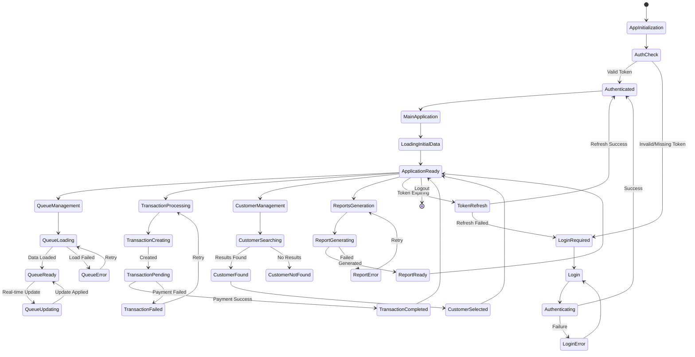

# EscaShop System Architecture - Knowledge Base

This document consolidates all architecture artifacts for the EscaShop Optical Queue Management System to serve as a reference for system development and maintenance.

## Document Inventory

This knowledge base contains the following architecture artifacts:

1. **Data Flow Diagram (Queue Management)** - `dfd_queue.mmd`
2. **Entity Relationship Diagram** - `entities_relationships.md`
3. **Component Architecture Diagram** - `component_architecture.mmd`
4. **Requirements Matrix** - `requirements_matrix.md`
5. **Customer Registration Integration Documentation** - `CUSTOMER_REGISTRATION_INTEGRATION.md`

---

## 1. Data Flow Diagram - Queue Management Process

**Source:** `dfd_queue.mmd`

### Overview
The queue management data flow diagram illustrates the interactions between staff, customers, and the system components during the queue management process.

### External Entities
- **Staff/Teller**: System operators managing customer queues
- **Customer**: End users receiving services
- **Display System**: Visual queue status displays
- **Audio System**: Audio announcement system

### Data Stores
- **Queue Database (DS1)**: Core queue management data
- **Service Counter DB (DS2)**: Counter assignment and status
- **Customer Database (DS3)**: Customer information and details
- **Activity Log (DS4)**: System audit trail

### Key Processes
1. **Get Current Queue Status (P1)**: Retrieve current queue state
2. **Select Next Customer (P2)**: Choose next customer for service
3. **Update Queue Position (P3)**: Modify customer position in queue
4. **Assign to Counter (P4)**: Assign customer to specific service counter
5. **Notify Customer (P5)**: Send notifications via display/audio/SMS
6. **Update Service Status (P6)**: Mark service completion
7. **Handle No-Show (P7)**: Manage customer no-show scenarios

### Data Flow Summary
The system follows a cycle where staff initiate queue operations, the system processes customer data, updates queue positions, assigns counters, notifies customers, and logs all activities for audit purposes.

---

## 2. Entity Relationship Model

**Source:** `entities_relationships.md`

### Core Entity Categories

#### User Management
- **Users**: System authentication and role management
  - Roles: Admin, Sales Employee, Cashier
  - Attributes include authentication data, role permissions, and reset tokens

#### Customer & Service Management
- **Customers**: Primary customer data with queue management fields
  - Includes personal info, prescription data, payment info, priority flags
  - Links to sales agents and contains JSONB fields for flexible data
- **Counters**: Service counter configuration for customer service
- **Queue_Events**: Individual queue event tracking
- **Queue_Analytics**: Hourly performance metrics
- **Daily_Queue_Summary**: Daily aggregated statistics

#### Transaction Management
- **Transactions**: Payment processing and financial records
- **Daily_Reports**: Financial reconciliation and reporting

#### Configuration Management
- **Grade_Types**: Prescription grade options
- **Lens_Types**: Available lens types
- **Dropdown_Options**: Dynamic dropdown configuration

#### Communication Systems
- **SMS_Templates**: Configurable message templates
- **SMS_Notifications**: SMS tracking and analytics
- **Notification_Logs**: Legacy SMS logging

#### Audit & Monitoring
- **Activity_Logs**: Immutable system audit trail

### Key Relationships
- Users → Customers (One-to-Many): Sales agents register customers
- Users → Transactions (One-to-Many): Staff process transactions
- Customers → Transactions (One-to-Many): Customer payment history
- Customers → Queue_Events (One-to-Many): Queue participation history
- Counters → Queue_Events (One-to-Many): Events occur at counters

---

## 3. Component Architecture

**Source:** `component_architecture.mmd`

### Frontend Components (React)
- **Dashboard**: Role-based system overview with transaction and queue management
- **Auth Context**: Authentication state management
- **Socket Context**: Real-time WebSocket communication
- **Transaction Management**: Payment processing interface
- **Queue Management**: Real-time queue operations

### Backend Services (Express.js/Node.js)
- **Express Routers**:
  - `/transactions`: Transaction management endpoints
  - `/payments`: Payment settlement services
  - `/customers`: Customer management operations
- **Services**:
  - **Transaction Service**: Business logic for payments
  - **Payment Settlement Service**: Payment processing
  - **WebSocket Manager**: Real-time communication
  - **Enhanced SMS Service**: Multi-provider SMS integration
  - **Customer Service**: Customer lifecycle management

### Data Layer (PostgreSQL)
- **transactions table**: Financial data storage
- **customers table**: Customer information storage

### External Integrations
- **SMS API**: Multi-provider SMS notifications
- **Google Sheets API**: Data export and synchronization

### Communication Flow
Frontend components communicate with backend services via REST APIs and WebSocket connections. Backend services interact with PostgreSQL for data persistence and external APIs for SMS and export functionality.

---

## 4. State Management

### Redux Store Structure

The EscaShop application uses Redux for centralized state management. Below is the TypeScript interface defining the complete application state:

```typescript
interface AppState {
  // Authentication State
  auth: {
    user: User | null;
    token: string | null;
    refreshToken: string | null;
    isAuthenticated: boolean;
    loading: boolean;
    error: string | null;
  };

  // Queue Management State
  queue: {
    customers: Customer[];
    currentServing: { [counterId: string]: Customer | null };
    counters: Counter[];
    queueStats: QueueStatistics;
    loading: boolean;
    error: string | null;
  };

  // Transaction Management State
  transactions: {
    items: Transaction[];
    dailyTotal: number;
    currentTransaction: Transaction | null;
    paymentMethods: PaymentMethod[];
    loading: boolean;
    error: string | null;
  };

  // Customer Management State
  customers: {
    list: Customer[];
    selectedCustomer: Customer | null;
    searchResults: Customer[];
    prescriptionData: PrescriptionData | null;
    loading: boolean;
    error: string | null;
  };

  // UI State
  ui: {
    sidebarOpen: boolean;
    activeModule: string;
    notifications: Notification[];
    theme: 'light' | 'dark';
    loading: boolean;
  };

  // Real-time Updates State
  realtime: {
    connected: boolean;
    lastHeartbeat: Date | null;
    pendingUpdates: any[];
    reconnectAttempts: number;
  };

  // Reports State
  reports: {
    dailyReports: DailyReport[];
    selectedDateRange: DateRange;
    exportStatus: 'idle' | 'exporting' | 'completed' | 'error';
    loading: boolean;
    error: string | null;
  };
}
```

### State Flow

The following diagram illustrates the state management flow within the EscaShop application:



---

## 5. Requirements Matrix

**Source:** `requirements_matrix.md`

### User Roles & Permissions

#### Admin (Full System Access)
- Complete system configuration
- User management (create/edit/deactivate)
- Financial reports access
- Activity log (read-only)
- Queue management & manual override
- SMS template management
- Counter & dropdown management
- Export to all formats (Excel, PDF, Google Sheets)
- **Module Access**: All modules

#### Sales Employee (Limited Access)
- Customer registration
- Prescription management
- Own performance data only
- Queue management (view only)
- Token printing
- Customer notifications (SMS)
- Export customer data
- **Module Access**: Dashboard, Customer Management, Queue (view), Display Monitor

#### Cashier (Transaction Focus)
- Payment processing
- Daily financial reports
- Transaction logs (read-only)
- Counter management
- Customer serving/calling
- Daily reconciliation
- **Module Access**: Dashboard, Transactions, Queue (serve customers), Display Monitor

### Technology Stack
- **Frontend**: React 18 + TypeScript + Tailwind CSS + Material-UI
- **Backend**: Node.js + Express.js + TypeScript
- **Database**: PostgreSQL with JSONB fields
- **Real-time**: Socket.IO for WebSocket communication
- **Authentication**: JWT with refresh token rotation

### External Integrations

#### SMS Providers
- **Twilio**: Global SMS service
- **Clicksend**: Philippines-friendly SMS
- **Vonage**: Formerly Nexmo SMS service
- **Generic API**: Custom SMS provider integration

#### Google Services
- **Google Apps Script**: Server-side export handler
- **Google Sheets API**: Real-time data synchronization

#### WebSocket Events
- `queue:update`: Queue status changes
- `customer:called`: Customer called to counter
- `customer:served`: Customer served
- `transaction:update`: Payment updates
- `auth:error`: Authentication errors
- `auth:expire_soon`: Token expiration warnings

---

## 6. Customer Registration Integration

**Source:** `CUSTOMER_REGISTRATION_INTEGRATION.md`

### Features Overview
This integration ensures newly registered customers appear in the sales page transaction list through optional initial transaction creation and enhanced database queries.

### Key Features

#### Optional Initial Transaction Creation
- **Purpose**: Ensures immediate visibility of new customers in transaction lists
- **Implementation**: Create unpaid transaction with amount 0 when `create_initial_transaction: true`
- **Benefit**: No delay waiting for actual transactions

#### Enhanced Transaction Queries
- **Change**: Modified from LEFT JOIN to INNER JOIN with customers table
- **Addition**: Includes customer contact, email, and queue status information
- **Result**: Better context for sales agents and cashiers

#### Real-time WebSocket Updates
- **Event**: `customer_created` emitted upon customer registration
- **Recipients**: All roles (sales, admin, cashier)
- **Payload**: Customer details, creation metadata, transaction status

### API Enhancements

#### Customer Creation Endpoint
```http
POST /api/customers
```
**New Parameter**: `create_initial_transaction` (boolean, optional, default: false)

#### Enhanced Transaction List Response
Includes additional customer information:
- customer_name
- customer_contact  
- customer_email
- customer_queue_status

### Database Impact
- **Initial Transactions**: Created with amount=0, payment_status="unpaid"
- **Query Enhancement**: INNER JOIN ensures only customers with transactions appear
- **No Schema Changes**: Uses existing table structure

### Benefits
- ✅ Immediate customer visibility in sales interface
- ✅ Enhanced customer context in transaction lists
- ✅ Real-time UI synchronization via WebSocket events
- ✅ Backward compatibility maintained
- ✅ Flexible implementation based on business needs

---

## System Integration Summary

### Architecture Highlights
1. **Role-Based Access Control**: Hierarchical permissions (Admin > Sales > Cashier)
2. **Real-time Operations**: WebSocket-driven queue and payment updates
3. **Multi-Provider SMS**: Provider-agnostic SMS service with failover
4. **Comprehensive Audit**: Immutable activity logging for compliance
5. **Responsive Design**: Mobile-friendly interface for all user roles

### Data Flow Integration
The system integrates queue management, customer registration, transaction processing, and real-time notifications through:
- PostgreSQL database with JSONB flexibility
- Express.js REST APIs for CRUD operations
- Socket.IO WebSocket for real-time updates
- Multi-provider SMS integration for customer notifications
- Google Sheets integration for data export and collaboration

### Security Implementation
- JWT-based authentication with refresh tokens
- bcrypt password hashing
- Rate limiting for API protection  
- CORS configuration for secure cross-origin requests
- Input validation for SQL injection and XSS prevention

---

**Last Updated:** December 2024
**Architecture Version:** Current Production
**Document Status:** Consolidated for Agent Reference

This knowledge base serves as the definitive reference for understanding the EscaShop system architecture, data models, and external integrations. It consolidates all architecture artifacts into a single reference document for development team use.
