# EscaShop Architecture Documentation

[](docs/architecture.md)
[](https://github.com/escashop/queue-system/actions)

## Table of Contents

- [Overview](#overview)
- [System Architecture](#system-architecture)
- [Component Architecture](#component-architecture)
- [Data Flow Diagrams](#data-flow-diagrams)
- [User Journey Flows](#user-journey-flows)
- [Integration Architecture](#integration-architecture)
- [Technology Stack](#technology-stack)
- [Code Structure](#code-structure)
- [Security Architecture](#security-architecture)
- [Deployment Architecture](#deployment-architecture)
- [API Documentation](#api-documentation)

## Overview

The EscaShop Optical Queue Management System is a comprehensive full-stack
application designed to streamline customer service operations. The system is
built with modern web technologies and follows best practices for scalability,
security, and maintainability.

### Key Features

- **Role-based Access Control**: Admin, Sales Employee, and Cashier roles with distinct permissions
- **Real-time Queue Management**: WebSocket-powered live updates for queue status
- **Customer Registration**: Complete customer data management with prescription handling
- **Payment Processing**: Multiple payment methods with settlement tracking
- **SMS Notifications**: Automated customer notifications via Vonage API
- **Financial Reporting**: Daily, weekly, and monthly transaction reports
- **Activity Logging**: Immutable audit trail for all system activities
- **Export Capabilities**: Excel, PDF, and Google Sheets integration

## System Architecture


The EscaShop system follows a modern three-tier architecture pattern:

### Presentation Layer
- **Frontend**: React.js with TypeScript and Tailwind CSS
- **State Management**: Redux Toolkit for global state management
- **Real-time Updates**: Socket.io client for WebSocket connections
- **UI Components**: Material-UI for consistent design language

### Application Layer
- **Backend API**: Node.js with Express.js framework
- **Authentication**: JWT-based authentication with role-based access control
- **Real-time Communication**: Socket.io server for WebSocket handling
- **Business Logic**: Service layer pattern for core functionality

### Data Layer
- **Primary Database**: PostgreSQL for transactional data
- **Session Storage**: In-memory session management
- **File Storage**: Local file system for temporary exports
- **External APIs**: Vonage SMS, Google Sheets API

## Component Architecture


### Frontend Components Structure

The React frontend is organized into logical component hierarchies:

```
src/
├── components/
│   ├── admin/           # Admin-only components
│   ├── auth/            # Authentication components
│   ├── common/          # Reusable UI components
│   ├── customers/       # Customer management
│   ├── dashboard/       # Main dashboard
│   ├── display/         # Queue display monitor
│   ├── layout/          # Layout components
│   ├── queue/           # Queue management
│   └── transactions/    # Transaction handling
├── contexts/            # React contexts for state
├── hooks/               # Custom React hooks
├── services/            # API service layer
├── types/               # TypeScript type definitions
└── utils/               # Utility functions
```

**Key Components:**

- [`App.tsx`](frontend/src/App.tsx): Main application with routing and providers
- [`Layout.tsx`](frontend/src/components/layout/Layout.tsx): Base layout with navigation
- [`Dashboard.tsx`](frontend/src/components/dashboard/Dashboard.tsx): Main dashboard interface
- [`QueueManagement.tsx`](frontend/src/components/queue/QueueManagement.tsx): Real-time queue handling

### Backend Service Architecture

The Node.js backend follows a service-oriented architecture:

```
src/
├── config/              # Configuration files
├── middleware/          # Express middleware
├── routes/              # API route handlers
├── services/            # Business logic services
├── types/               # TypeScript interfaces
├── validation/          # Input validation schemas
└── database/            # Database configuration
```

**Core Services:**

- [`index.ts`](backend/src/index.ts): Main server entry point
- [`websocket.ts`](backend/src/services/websocket.ts): Real-time communication
- [`customer.ts`](backend/src/services/customer.ts): Customer management logic
- [`queue.ts`](backend/src/services/queue.ts): Queue operations
- [`transaction.ts`](backend/src/services/transaction.ts): Payment processing

## Data Flow Diagrams

### Customer Registration Flow


The customer registration process involves:

1. **Input Validation**: Client-side validation using React Hook Form
2. **API Request**: Secure API call with JWT authentication
3. **Database Storage**: PostgreSQL transaction with constraint validation
4. **Real-time Update**: WebSocket notification to connected clients
5. **Receipt Generation**: Automatic token number assignment and printing

**Code References:**
- Registration form: [`CustomerManagement.tsx`](frontend/src/components/customers/CustomerManagement.tsx)
- API endpoint: [`customers.ts`](backend/src/routes/customers.ts)
- Service logic: [`customer.ts`](backend/src/services/customer.ts)

### Payment Processing Flow


The payment settlement system handles multiple payment methods:

1. **Payment Method Selection**: Support for Cash, GCash, Maya, Credit Card, Bank Transfer
2. **Amount Validation**: Backend validation with currency formatting
3. **Transaction Recording**: Immutable transaction log with audit trail
4. **Settlement Processing**: Daily reconciliation with petty cash management
5. **Report Generation**: Automated financial reporting

**Code References:**
- Payment form: [`EnhancedTransactionManagement.tsx`](frontend/src/components/transactions/EnhancedTransactionManagement.tsx)
- Payment API: [`transactions.ts`](backend/src/routes/transactions.ts)
- Settlement service: [`paymentSettlementService.ts`](backend/src/services/paymentSettlementService.ts)

### Queue Management Flow


Real-time queue management with priority handling:

1. **Queue Status Updates**: Live updates via WebSocket connections
2. **Priority Logic**: Automatic prioritization for Senior Citizens, Pregnant, PWD
3. **Manual Override**: Admin drag-and-drop queue reordering
4. **Notification System**: SMS alerts when customers are called
5. **Display Updates**: Real-time counter display updates

**Code References:**
- Queue component: [`QueueManagement.tsx`](frontend/src/components/queue/QueueManagement.tsx)
- WebSocket service: [`websocket.ts`](backend/src/services/websocket.ts)
- Queue service: [`queue.ts`](backend/src/services/queue.ts)

### Reporting Data Flow


Comprehensive reporting system with multiple export formats:

1. **Data Aggregation**: Real-time transaction summarization
2. **Report Generation**: On-demand PDF, Excel, and Google Sheets export
3. **Date Range Filtering**: Flexible date-based report filtering
4. **Role-based Access**: Different report access levels by user role
5. **Export Integration**: Google Apps Script for Sheets integration

**Code References:**
- Reports component: [`EnhancedTransactionManagement.tsx`](frontend/src/components/transactions/EnhancedTransactionManagement.tsx)
- Export service: [`export.ts`](backend/src/services/export.ts)
- Google Apps Script: [`escashop-export.js`](google-apps-script/escashop-export.js)

## User Journey Flows

### Admin User Journey


The admin user has comprehensive system access:

1. **System Management**: User account management, system configuration
2. **Queue Control**: Manual queue reordering and priority management
3. **Financial Oversight**: Access to all transaction reports and analytics
4. **System Configuration**: Dropdown management, counter setup, SMS templates
5. **Activity Monitoring**: Complete audit log access

### Sales Employee Journey


Sales employees focus on customer registration and service:

1. **Customer Registration**: Complete customer data entry with prescription details
2. **Queue Monitoring**: View waiting customers and queue status
3. **Token Printing**: Generate and print customer tokens
4. **Performance Tracking**: View personal sales metrics
5. **Basic Reporting**: Access to own sales data

### Cashier Journey


Cashiers handle payment processing and reconciliation:

1. **Payment Processing**: Handle multiple payment methods
2. **Daily Reconciliation**: Petty cash start/end management
3. **Transaction Reports**: Access to daily financial summaries
4. **Receipt Management**: Print payment receipts
5. **Settlement Tracking**: Monitor payment settlements

## Integration Architecture


### External Service Integrations

**SMS Service (Vonage)**
- **Purpose**: Customer notifications when orders are ready
- **Implementation**: [`EnhancedSMSService.ts`](backend/src/services/EnhancedSMSService.ts)
- **Features**: Template management, delivery tracking, rate limiting

**Google Sheets Integration**
- **Purpose**: Real-time data export for management reporting
- **Implementation**: [`escashop-export.js`](google-apps-script/escashop-export.js)
- **Features**: Automated data synchronization, formatted reports

**Email Service**
- **Purpose**: Password reset and system notifications
- **Implementation**: [`email.ts`](backend/src/services/email.ts)
- **Features**: SMTP configuration, template support

## Technology Stack

### Frontend Technologies

| Technology | Version | Purpose | Documentation |
|------------|---------|---------|---------------|
| React | 19.1.0 | UI Framework | [React Docs](https://react.dev/) |
| TypeScript | 4.9.5 | Type Safety | [TS Docs](https://www.typescriptlang.org/) |
| Material-UI | 7.2.0 | UI Components | [MUI Docs](https://mui.com/) |
| Tailwind CSS | 4.1.11 | Utility Styling | [Tailwind Docs](https://tailwindcss.com/) |
| Socket.io Client | 4.8.1 | Real-time Communication | [Socket.io Docs](https://socket.io/) |
| React Router | 7.6.3 | Client Routing | [Router Docs](https://reactrouter.com/) |

### Backend Technologies

| Technology | Version | Purpose | Documentation |
|------------|---------|---------|---------------|
| Node.js | 20+ | Runtime | [Node.js Docs](https://nodejs.org/) |
| Express.js | 4.18.2 | Web Framework | [Express Docs](https://expressjs.com/) |
| TypeScript | 5.2.2 | Type Safety | [TS Docs](https://www.typescriptlang.org/) |
| PostgreSQL | 12+ | Database | [PostgreSQL Docs](https://www.postgresql.org/) |
| Socket.io | 4.8.1 | WebSocket Server | [Socket.io Docs](https://socket.io/) |
| JWT | 9.0.0 | Authentication | [JWT Docs](https://jwt.io/) |

### Development Tools

| Tool | Purpose | Configuration |
|------|---------|---------------|
| Jest | Testing Framework | [`jest.config.js`](backend/jest.config.js) |
| ESLint | Code Linting | [`eslint.config.js`](backend/eslint.config.js) |
| Nodemon | Development Server | Hot reloading for backend |
| Concurrently | Process Management | Runs frontend and backend together |

## Code Structure

### Project Organization

```
escashop/
├── backend/                 # Node.js API server
│   ├── src/
│   │   ├── config/         # Configuration files
│   │   ├── middleware/     # Express middleware
│   │   ├── routes/         # API endpoints
│   │   ├── services/       # Business logic
│   │   ├── types/          # TypeScript types
│   │   └── validation/     # Input validation
│   └── package.json
├── frontend/               # React application
│   ├── src/
│   │   ├── components/     # React components
│   │   ├── contexts/       # React contexts
│   │   ├── hooks/          # Custom hooks
│   │   ├── services/       # API services
│   │   └── types/          # TypeScript types
│   └── package.json
├── docs/                   # Documentation
│   ├── diagrams/          # Architecture diagrams
│   └── architecture.md    # This file
├── google-apps-script/    # GAS integration
└── package.json           # Workspace configuration
```

### Key Architectural Patterns

**Service Layer Pattern**
- Business logic separated from controllers
- Reusable service methods across different routes
- Example: [`customer.ts`](backend/src/services/customer.ts)

**Repository Pattern**
- Database access abstraction
- Consistent data access methods
- SQL queries centralized in services

**Provider Pattern (React)**
- Context-based state management
- Authentication and theme providers
- Example: [`AuthContext.tsx`](frontend/src/contexts/AuthContext.tsx)

**Middleware Pattern**
- Cross-cutting concerns handled by middleware
- Authentication, rate limiting, error handling
- Example: [`auth.ts`](backend/src/middleware/auth.ts)

## Security Architecture

### Authentication & Authorization

**JWT Token Strategy**
- Access tokens (15 minutes) + Refresh tokens (7 days)
- Role-based access control (RBAC)
- Secure HTTP-only cookies for token storage

**Password Security**
- Argon2 hashing algorithm
- Salt-based password storage
- Password complexity requirements

**API Security**
- Rate limiting with Redis backing
- Input validation and sanitization
- CORS configuration
- HTTPS enforcement

**Code References:**
- Authentication: [`auth.ts`](backend/src/middleware/auth.ts)
- JWT Service: [`jwtService.ts`](backend/src/services/jwtService.ts)
- Rate Limiting: [`rateLimiter.ts`](backend/src/middleware/rateLimiter.ts)

### Data Protection

**Database Security**
- Parameterized queries to prevent SQL injection
- Connection pooling with SSL
- Backup and recovery procedures

**Session Management**
- Automatic session timeout (10 minutes idle)
- Secure session invalidation
- Session warning system

## Deployment Architecture

### Blue/Green Deployment Strategy (v3.1.0)

Our production deployment uses a **Blue/Green** strategy for zero-downtime updates:

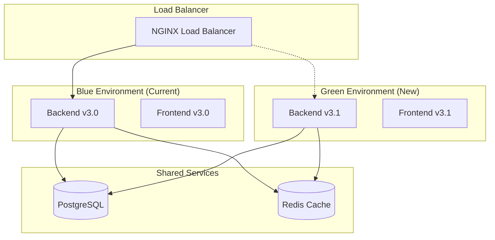

**Key Benefits:**
- ✅ **Zero downtime**: Instant traffic switching
- ✅ **Safe rollback**: Return to previous version in 30 seconds
- ✅ **Forward compatibility**: Database migrations support both versions
- ✅ **Enum safety**: Non-breaking enum value additions

**Deployment Process:**
1. **Database Migration** (5-10 min): Apply forward-compatible schema changes
2. **Backend Deployment** (10-15 min): Deploy to Green environment
3. **Frontend Deployment** (10-15 min): Deploy UI to Green environment
4. **Traffic Cutover** (1-2 min): Switch load balancer to Green
5. **Verification** (10 min): Monitor health and performance

**Rollback Strategy:**
- **Immediate**: Switch traffic back to Blue environment (30 seconds)
- **UI Feature Rollback**: Hide new features via feature flags
- **Database Compatibility**: Keep enum values, add-only migrations

### Development Environment

```bash
# Start all services
npm run dev

# Individual services
npm run dev:backend    # Backend on port 5000
npm run dev:frontend   # Frontend on port 3000
```

**Development URLs:**
- Frontend: http://localhost:3000
- Backend API: http://localhost:5000
- API Health Check: http://localhost:5000/health

### Production Infrastructure

**Environment Configuration:**

| Component | Blue Environment | Green Environment |
|-----------|------------------|-------------------|
| **Backend** | Port 5000, v3.0 | Port 5001, v3.1 |
| **Frontend** | Port 3000, v3.0 | Port 3001, v3.1 |
| **Database** | Shared PostgreSQL | Shared PostgreSQL |
| **Cache** | Shared Redis | Shared Redis |

**Recommended Infrastructure:**

**Frontend Deployment**
- Platform: Vercel or Netlify
- Build Command: `npm run build`
- Output Directory: `frontend/build`

**Backend Deployment**
- Platform: Heroku, DigitalOcean App Platform, or AWS EC2
- Build Command: `npm run build`
- Start Command: `npm start`

**Database**
- Managed PostgreSQL (AWS RDS, DigitalOcean Managed DB)
- Automated backups (daily, 14-day retention)
- Connection pooling enabled

### Environment Configuration

**Backend Environment Variables:**
```env
NODE_ENV=production
DATABASE_URL=postgresql://...
JWT_SECRET=...
JWT_REFRESH_SECRET=...
VONAGE_API_KEY=...
VONAGE_API_SECRET=...
SMTP_HOST=...
SMTP_USER=...
SMTP_PASS=...
```

**Frontend Environment Variables:**
```env
REACT_APP_API_URL=https://api.escashop.com
REACT_APP_SOCKET_URL=https://api.escashop.com
```

## API Documentation

### Authentication Endpoints

| Method | Endpoint | Description | Authentication |
|--------|----------|-------------|----------------|
| POST | `/api/auth/login` | User authentication | None |
| POST | `/api/auth/refresh` | Token refresh | Refresh token |
| POST | `/api/auth/logout` | User logout | Access token |
| POST | `/api/auth/request-password-reset` | Request password reset | None |
| POST | `/api/auth/reset-password` | Reset password | Reset token |

### Customer Management

| Method | Endpoint | Description | Role Access |
|--------|----------|-------------|-------------|
| GET | `/api/customers` | List all customers | All roles |
| POST | `/api/customers` | Create new customer | Sales, Admin |
| PUT | `/api/customers/:id` | Update customer | Sales, Admin |
| DELETE | `/api/customers/:id` | Delete customer | Admin only |

### Queue Operations

| Method | Endpoint | Description | Role Access |
|--------|----------|-------------|-------------|
| GET | `/api/queue` | Get queue status | All roles |
| POST | `/api/queue/call-next` | Call next customer | Admin |
| PUT | `/api/queue/reorder` | Reorder queue | Admin |
| POST | `/api/queue/priority` | Set priority | Admin |

### Transaction Management

| Method | Endpoint | Description | Role Access |
|--------|----------|-------------|-------------|
| GET | `/api/transactions` | List transactions | Cashier, Admin |
| POST | `/api/transactions/settle` | Process payment | Cashier, Admin |
| GET | `/api/transactions/reports` | Generate reports | Cashier, Admin |
| POST | `/api/transactions/export` | Export data | Admin |

### WebSocket Events

**Client → Server Events:**
- `join-queue`: Join queue monitoring
- `leave-queue`: Leave queue monitoring
- `call-customer`: Call specific customer
- `update-queue-order`: Update queue positions

**Server → Client Events:**
- `queue-updated`: Queue status changed
- `customer-called`: Customer notification
- `display-updated`: Display monitor update
- `notification`: System notifications

### Error Handling

The API uses consistent error response format:

```json
{
  "error": {
    "code": "VALIDATION_ERROR",
    "message": "Invalid input data",
    "details": {
      "field": "email",
      "reason": "Invalid email format"
    }
  }
}
```

**Common Error Codes:**
- `AUTHENTICATION_ERROR`: Invalid or expired token
- `AUTHORIZATION_ERROR`: Insufficient permissions
- `VALIDATION_ERROR`: Invalid input data
- `RATE_LIMIT_ERROR`: Too many requests
- `INTERNAL_ERROR`: Server-side error

---

## Maintenance and Support

### Monitoring

**Health Checks:**
- API health endpoint: `/health`
- Database connection monitoring
- WebSocket connection status

**Logging:**
- Structured logging with timestamps
- Error tracking and alerting
- Performance metrics

### Backup and Recovery

**Database Backups:**
- Automated daily backups
- 14-day retention period
- Point-in-time recovery capability

**Code Backups:**
- Git version control
- Automated CI/CD pipelines
- Staging environment for testing

### Updates and Maintenance

**Dependency Updates:**
- Regular security updates
- Automated vulnerability scanning
- Staging environment testing

**Feature Deployment:**
- Feature flags for gradual rollout
- Database migration scripts
- Rollback procedures

---

*This documentation is automatically maintained and updated with each release. Last updated: January 27, 2025 (v3.1.0)*

**Related Documentation:**
- [User Manual](../README.md#user-stories-and-acceptance-criteria)
- [Setup Guide](../README.md#development-setup)
- [API Reference](../README.md#technical-requirements--stack)
- [Security Guide](../SECURITY_HARDENING_GUIDE.md)
