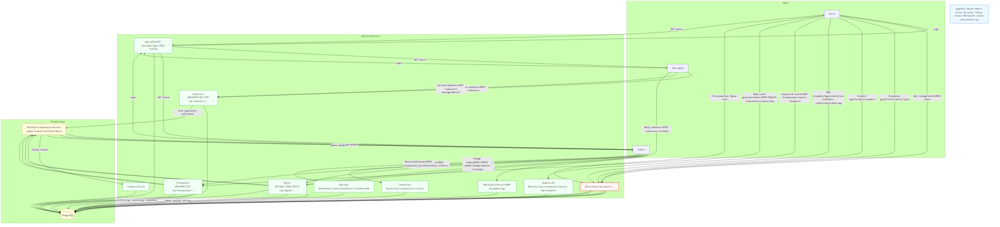
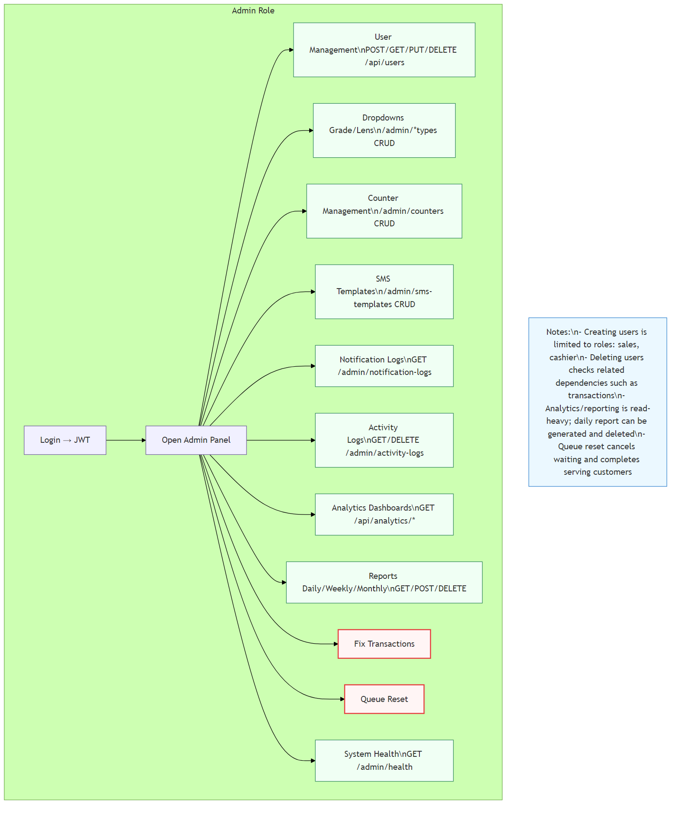
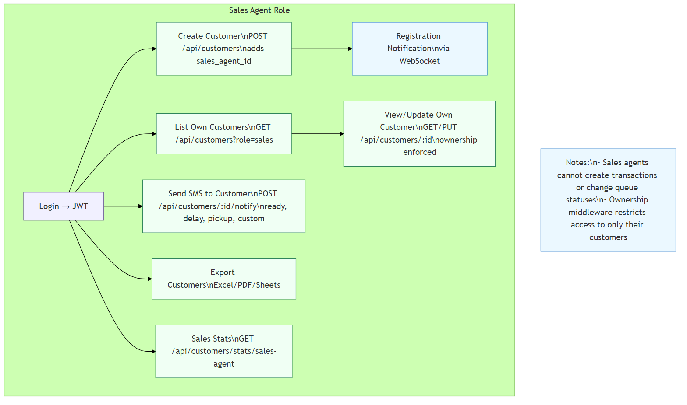
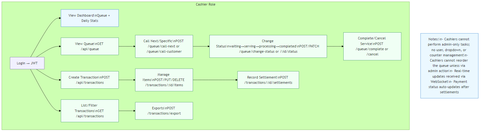

# EscaShop System Flowcharts

This directory contains Mermaid-based flowcharts that document the EscaShop system. Each PNG is rendered for readability on Windows using the forest theme, a white background, and 2x scale.

## Diagrams

### System Overview
High-level architecture showing user roles, backend services, infrastructure, and real-time flows.



### Admin Flow
Administrative operations: user management, dropdowns, counters, SMS templates, logs, analytics, and reports. Risky operations (fix transactions, queue reset) highlighted.



### Sales Agent Flow
Sales agent operations: create customers (auto-assigns sales_agent_id), WebSocket registration notifications, manage own customers, send SMS, export data, view stats.



### Cashier Flow
Cashier operations: queue management, service status transitions, transactions, items, settlements, transaction lists, and exports. Admin-only tasks are not permitted.



## Regenerating PNGs (recommended settings)
Use Node.js and npx to render the diagrams from their `.mmd` sources. The following commands use the forest theme, white background, and 2x scale for crisp, user-friendly images:

```bash
npx -y -p @mermaid-js/mermaid-cli mmdc -i docs/diagrams/00_system-overview.mmd -o docs/diagrams/00_system-overview.png -t forest -b white --scale 2
npx -y -p @mermaid-js/mermaid-cli mmdc -i docs/diagrams/10_admin-flow.mmd -o docs/diagrams/10_admin-flow.png -t forest -b white --scale 2
npx -y -p @mermaid-js/mermaid-cli mmdc -i docs/diagrams/20_sales-agent-flow.mmd -o docs/diagrams/20_sales-agent-flow.png -t forest -b white --scale 2
npx -y -p @mermaid-js/mermaid-cli mmdc -i docs/diagrams/30_cashier-flow.mmd -o docs/diagrams/30_cashier-flow.png -t forest -b white --scale 2
```

## Viewing tips
- Open with the Windows Photos app or your preferred image viewer
- Zoom to 125–150% for detailed reading
- Light theme (white background) improves contrast with color-coded borders

## Color coding
- Purple borders: Roles (Admin, Sales Agent, Cashier)
- Green borders: Services (Auth, Customers, Queue, Transactions, etc.)
- Yellow borders: Infrastructure (PostgreSQL, WebSocket)
- Red borders: Risky operations (admin-only sensitive actions)

