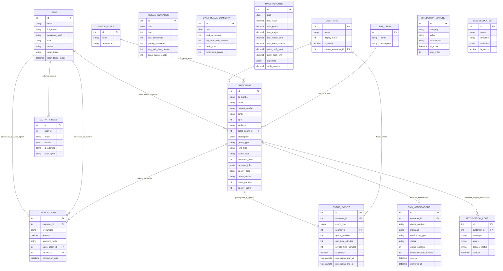

# EscaShop Core Entities & Relationships

## Core Entities Identified

### 1. User Management Entities

#### **Users**
- **Primary Key**: `id`
- **Attributes**: `email`, `full_name`, `password_hash`, `role`, `status`, `reset_token`, `reset_token_expiry`
- **Description**: System users with role-based access (Admin, Sales Employee, Cashier)

### 2. Customer & Service Entities

#### **Customers** 
- **Primary Key**: `id`
- **Attributes**: `or_number`, `name`, `contact_number`, `email`, `age`, `address`, `sales_agent_id`, `prescription`, `grade_type`, `lens_type`, `frame_code`, `estimated_time`, `payment_info`, `priority_flags`, `queue_status`, `token_number`, `priority_score`
- **Description**: Customer registration and queue management

#### **Counters**
- **Primary Key**: `id` 
- **Attributes**: `name`, `display_order`, `is_active`, `current_customer_id`
- **Description**: Service counter configuration for customer service

### 3. Queue Management Entities

#### **Queue_Events**
- **Primary Key**: `id`
- **Attributes**: `customer_id`, `event_type`, `counter_id`, `queue_position`, `wait_time_minutes`, `service_time_minutes`, `is_priority`, `processing_start_at`, `processing_end_at`
- **Description**: Tracks individual queue events and customer flow with SLA metrics

#### **Queue_Analytics**
- **Primary Key**: `id`
- **Attributes**: `date`, `hour`, `total_customers`, `priority_customers`, `avg_wait_time_minutes`, `peak_queue_length`
- **Description**: Hourly queue performance metrics

#### **Daily_Queue_Summary**
- **Primary Key**: `id`
- **Attributes**: `date`, `total_customers`, `avg_wait_time_minutes`, `peak_hour`, `customers_served`
- **Description**: Daily aggregated queue statistics

### 4. Transaction Entities

#### **Transactions**
- **Primary Key**: `id`
- **Attributes**: `customer_id`, `or_number`, `amount`, `payment_mode`, `sales_agent_id`, `cashier_id`, `transaction_date`
- **Description**: Payment processing and financial records

#### **Daily_Reports**
- **Primary Key**: `id`
- **Attributes**: `date`, `total_cash`, `total_gcash`, `total_maya`, `total_credit_card`, `total_bank_transfer`, `petty_cash_start`, `petty_cash_end`, `expenses`, `cash_turnover`
- **Description**: Daily financial reporting and reconciliation

### 5. Configuration Entities

#### **Grade_Types**
- **Primary Key**: `id`
- **Attributes**: `name`, `description`
- **Description**: Prescription grade configuration options

#### **Lens_Types**
- **Primary Key**: `id`
- **Attributes**: `name`, `description`  
- **Description**: Available lens type options

#### **Dropdown_Options**
- **Primary Key**: `id`
- **Attributes**: `category`, `value`, `display_text`, `is_active`, `sort_order`
- **Description**: Dynamic dropdown configuration management

### 6. Communication Entities

#### **SMS_Templates**
- **Primary Key**: `id`
- **Attributes**: `name`, `template`, `variables`, `is_active`
- **Description**: Configurable SMS message templates

#### **SMS_Notifications**
- **Primary Key**: `id`
- **Attributes**: `customer_id`, `phone_number`, `message`, `notification_type`, `status`, `queue_position`, `estimated_wait_minutes`, `sent_at`, `delivered_at`
- **Description**: SMS tracking and delivery analytics

#### **Notification_Logs**
- **Primary Key**: `id`
- **Attributes**: `customer_id`, `message`, `status`, `delivery_status`, `sent_at`
- **Description**: Legacy SMS logging system

### 7. Audit & Monitoring Entities

#### **Activity_Logs**
- **Primary Key**: `id`
- **Attributes**: `user_id`, `action`, `details`, `ip_address`, `user_agent`
- **Description**: Immutable system audit trail

## Entity Relationships

### Primary Relationships

1. **Users → Customers** (One-to-Many)
   - Sales agents can register multiple customers
   - Foreign Key: `customers.sales_agent_id` → `users.id`

2. **Users → Transactions** (One-to-Many)
   - Sales agents and cashiers process transactions
   - Foreign Keys: `transactions.sales_agent_id` → `users.id`, `transactions.cashier_id` → `users.id`

3. **Customers → Transactions** (One-to-Many)
   - Each customer can have multiple transactions
   - Foreign Key: `transactions.customer_id` → `customers.id`

4. **Customers → Queue_Events** (One-to-Many)
   - Customer queue history and events
   - Foreign Key: `queue_events.customer_id` → `customers.id`

5. **Counters → Queue_Events** (One-to-Many)
   - Queue events occur at specific counters
   - Foreign Key: `queue_events.counter_id` → `counters.id`

6. **Counters → Customers** (One-to-One)
   - Current customer being served at counter
   - Foreign Key: `counters.current_customer_id` → `customers.id`

7. **Customers → SMS_Notifications** (One-to-Many)
   - SMS notifications sent to customers
   - Foreign Key: `sms_notifications.customer_id` → `customers.id`

8. **Users → Activity_Logs** (One-to-Many)
   - User actions tracked in audit logs
   - Foreign Key: `activity_logs.user_id` → `users.id`

### Configuration Relationships

9. **Grade_Types → Customers** (One-to-Many)
   - Customers have specific prescription grades
   - Referenced by: `customers.grade_type`

10. **Lens_Types → Customers** (One-to-Many)
    - Customers select lens types
    - Referenced by: `customers.lens_type`

## Business Rules & Constraints

### Queue Management Rules
- Customers have priority scores affecting queue position
- One customer can be served at one counter at a time
- Queue events track customer flow through service process
- Queue status supports: waiting, serving, processing, completed, cancelled
- Processing timestamps enable SLA metrics and performance tracking

### Financial Rules
- Transactions must have associated customers and staff
- Daily reports aggregate multiple payment modes
- All financial activities must be auditable

### Communication Rules
- SMS notifications tied to specific queue positions
- Templates support variable substitution
- Delivery status tracking for compliance

### Security Rules
- All user actions logged immutably
- Role-based access controls enforced
- Password reset tokens have expiration

## Mermaid ER Diagram

---

*This entity analysis forms the foundation for database design and system architecture planning.*
